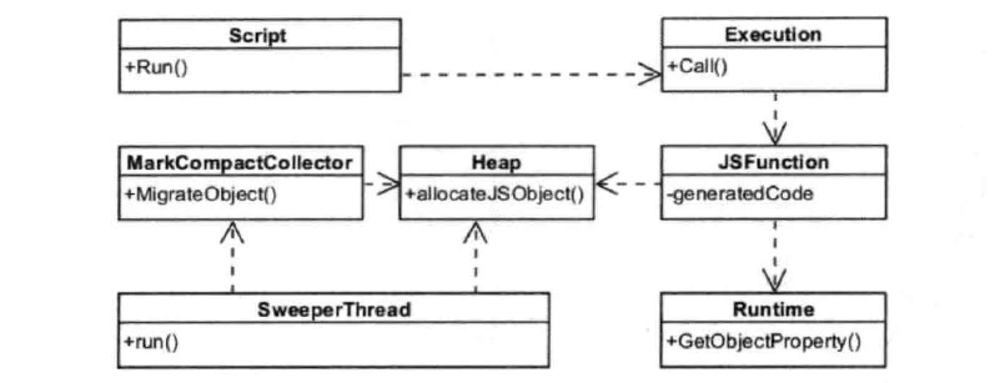

# v8引擎

## v8引擎出现的原因
编译型语言： 在程序执行之前必须进行专门的编译过程，有如下特点：
```
只须编译一次就可以把源代码编译成机器语言，后面的执行无须重新编译，直接使用之前的编译结果就可以；因此其执行的效率比较高；
编译性语言代表：C、C++、Java、Pascal/Object Pascal（Delphi）；
程序执行效率比较高，但比较依赖编译器，因此跨平台性差一些；
不同平台对编译器影响较大。
    16位系统下int是2个字节（16位），而32位系统下int占4个字节（32位）；
    32位系统下long类型占4字节，而64位系统下long类型占8个字节；
```

解释性语言 - 解释行语言，支持动态类型，弱类型，在程序运行的时候才进行编译，而编译前需要确定变量的类型，效率比较低，对不同系统平台有较大的兼容性.
```
源代码不能直接翻译成机器语言，而是先翻译成中间代码，再由解释器对中间代码进行解释运行；
    源代码—>中间代码—>机器语言
程序不需要编译，程序在运行时才翻译成机器语言，每执行一次都要翻译一次；
解释性语言代表：Python、JavaScript、Shell、Ruby、MATLAB等；
运行效率一般相对比较低，依赖解释器，跨平台性好；
```

比较：
```
一般，编译性语言的运行效率比解释性语言更高；但是不能一概而论，部分解释性语言的解释器通过在运行时动态优化代码，甚至能使解释性语言的性能超过编译性语言；
编译性语言的跨平台特性比解释性语言差一些；
```

进过以上说明，解释性语言，运行效率低，随着Web相关技术的发展，JavaScript所要承担的工作也越来越多，早就超越了“表单验证”的范畴，这就更需要快速的解析和执行JavaScript脚本。V8引擎就是为解决这一问题而生，在node中也是采用该引擎来解析JavaScript。

## JavaScript引擎
JavaScript本质上是一种解释型语言，与编译型语言不同的是它需要**一边执行一边解析**，而编译型语言在执行时已经完成编译，可直接执行，有更快的执行速度(如上图所示)。JavaScript代码是在浏览器端解析和执行的，如果需要时间太长，会影响用户体验。那么提高JavaScript的解析速度就是当务之急。

JavaScript语言是解释型语言，为了提高性能，引入了Java虚拟机和C++编译器中的众多技术。现在JavaScript引擎的执行过程大致是:

源代码-→抽象语法树-→字节码-→JIT-→本地代码(V8引擎没有中间字节码)。

V8更加直接的将抽象语法树通过JIT技术转换成本地代码，放弃了在字节码阶段可以进行的一些性能优化，但保证了执行速度。在V8生成本地代码后，也会通过Profiler采集一些信息，来优化本地代码。虽然，少了生成字节码这一阶段的性能优化，但极大减少了转换时间。

但是在2017年4月底，v8 的 5.9 版本发布了，新增了一个 Ignition 字节码解释器，将默认启动，从此之后将与JSCore有大致相同的流程。做出这一改变的原因为：（主要动机）减轻机器码占用的内存空间，即牺牲时间换空间；提高代码的启动速度；对 v8 的代码进行重构，降低 v8 的代码复杂度

## V8引擎
- V8引擎是一个JavaScript引擎实现，最初由一些语言方面专家设计，后被谷歌收购，随后谷歌对其进行了开源。
- V8使用C++开发，在运行JavaScript之前，相比其它的JavaScript的引擎转换成字节码或解释执行，V8将其编译成原生机器码（IA-32, x86-64, ARM, or MIPS CPUs），并且使用了如内联缓存（inline caching）等方法来提高性能。
- 有了这些功能，JavaScript程序在V8引擎下的运行速度媲美二进制程序。
- V8支持众多操作系统，如windows、linux、android等，也支持其他硬件架构，如IA32,X64,ARM等，具有很好的可移植和跨平台特性。

## V8工作过程
V8引擎在执行JavaScript的过程中，主要有两个阶段：编译和运行，与C++的执行前完全编译不同的是，JavaScript需要在用户使用时完成编译和执行。在V8中，JavaScript相关代码并非一下完成编译的，而是在某些代码需要执行时，才会进行编译，这就提高了响应时间，减少了时间开销。在V8引擎中，源代码先被解析器转变为抽象语法树(AST)，然后使用JIT编译器的全代码生成器从AST直接生成本地可执行代码。这个过程不同于JAVA先生成字节码或中间表示，减少了AST到字节码的转换时间，提高了代码的执行速度。但由于缺少了转换为字节码这一中间过程，也就减少了优化代码的机会。

V8引擎编译本地代码时使用的主要类如下所示：

- Script：表示JavaScript代码，即包含源代码，又包含编译之后生成的本地代码，即是编译入口，又是运行入口；
- Compiler：编译器类，辅组Script类来编译生成代码，调用解释器(Parser)来生成AST和全代码生成器，将AST转变为本地代码；
- AstNode：抽象语法树节点类，是其他所有节点的基类，包含非常多的子类，后面会针对不同的子类生成不同的本地代码；
- AstVisitor：抽象语法树的访问者类，主要用来遍历异构的抽象语法树；
- FullCodeGenerator：AstVisitor类的子类，通过遍历AST来为JavaScript生成本地可执行代码。


JavaScript代码编译的过程大致为：Script类调用Compiler类的Compile函数为其生成本地代码。Compile函数先使用Parser类生成AST，再使用FullCodeGenerator类来生成本地代码。本地代码与具体的硬件平台密切相关，FullCodeGenerator使用多个后端来生成与平台相匹配的本地汇编代码。由于FullCodeGenerator通过遍历AST来为每个节点生成相应的汇编代码，缺失了全局视图，节点之间的优化也就无从谈起。

在执行编译之前，V8会构建众多全局对象并加载一些内置的库（如math库），来构建一个运行环境。而且在JavaScript源代码中，并非所有的函数都被编译生成本地代码，而是延迟编译，在调用时才会编译。

由于V8缺少了生成中间代码这一环节，缺少了必要的优化，为了提升性能，V8会在生成本地代码后，使用数据分析器(profiler)采集一些信息，然后根据这些数据将本地代码进行优化，生成更高效的本地代码，这是一个逐步改进的过程。同时，当发现优化后代码的性能还不如未优化的代码，V8将退回原来的代码，也就是优化回滚。下面介绍一下运行阶段，该阶段使用的主要类如下所示：

- Script：表示JavaScript代码，即包含源代码，又包含编译之后生成的本地代码，即是编译入口，又是运行入口；
- Execution：运行代码的辅组类，包含一些重要函数，如Call函数，它辅组进入和执行Script代码；
- JSFunction：需要执行的JavaScript函数表示类；
- Runtime：运行这些本地代码的辅组类，主要提供运行时所需的辅组函数，如：属性访问、类型转换、编译、算术、位操作、比较、正则表达式等；
- Heap：运行本地代码需要使用的内存堆类；
- MarkCompactCollector：垃圾回收机制的主要实现类，用来标记、清除和整理等基本的垃圾回收过程；
- SweeperThread：负责垃圾回收的线程。



先根据需要编译和生成这些本地代码，也就是使用编译阶段那些类和操作。在V8中，函数是一个基本单位，当某个JavaScript函数被调用时，V8会查找该函数是否已经生成本地代码，如果已经生成，则直接调用该函数。否则，V8引擎会生成属于该函数的本地代码。这就节约了时间，减少了处理那些使用不到的代码的时间。其次，执行编译后的代码为JavaScript构建JS对象，这需要Runtime类来辅组创建对象，并需要从Heap类分配内存。再次，借助Runtime类中的辅组函数来完成一些功能，如属性访问等。最后，将不用的空间进行标记清除和垃圾回收。

## V8 VS JavaScriptCore
JavaScriptCore引擎是WebKit中默认的JavaScript引擎，也是苹果开源的一个项目，应用较为广泛。最初，性能不是很好，从2008年开始了一系列的优化，重新实现了编译器和字节码解释器，使得引擎的性能有较大的提升。随后内嵌缓存、基于正则表达式的JIT、简单的JIT及字节码解释器等技术引入进来，JavaScriptCore引擎也在不断的迭代和发展。

V8引擎自诞生之日起就以性能优化作为目标，引入了众多新技术，极大了带动了整个业界JavaScript引擎性能的快速发展。总的来说，V8引擎较为激进，青睐可以提高性能的新技术，而JavaScriptCore引擎较为稳健，渐进式的改变着自己的性能。

JavaScriptCore 的大致流程为：源代码-→抽象语法树-→字节码-→JIT-→本地代码。JavaScriptCore与V8有一些不同之处，其中最大的不同就是新增了字节码的中间表示，并加入了多层JIT编译器（如：简单JIT编译器、DFG JIT编译器、LLVM等）优化性能，不停的对本地代码进行优化。

还有就是在数据表示方面，V8在不同的机器上使用与机器位数相匹配的数据表示，而在JavaScriptCore中句柄都是使用64位表示，其可以表示更大范围的数字，所以即使在32位机器上，浮点类型同样可以保存在句柄中，不再需要访问堆中的数据，当也会占用更多的空间。

## 注意
结合上面对于V8引擎的介绍，我们在编程中应注意：

- 类型。对于函数，JavaScript是一种动态类型语言，JavaScriptCore和V8都使用隐藏类和内嵌缓存来提高性能，为了保证缓存命中率，一个函数应该使用较少的数据类型；对于数组，应尽量存放相同类型的数据，这样就可以通过偏移位置来访问。
- 数据表示。简单类型数据（如整型）直接保存在句柄中，可以减少寻址时间和内存占用，如果可以使用整数表示的，尽量不要用浮点类型。
- 内存。虽然JavaScript语言会自己进行垃圾回收，但我们也应尽量做到及时回收不用的内存，对不再使用的对象设置为null或使用delete方法来删除(使用delete方法删除会触发隐藏类新建，需要更多的额外操作)。
- 优化回滚。在执行多次之后，不要出现修改对象类型的语句，尽量不要触发优化回滚，否则会大幅度降低代码的性能。
- 新机制。使用JavaScript引擎或者渲染引擎提供的新机制和新接口提高性能。