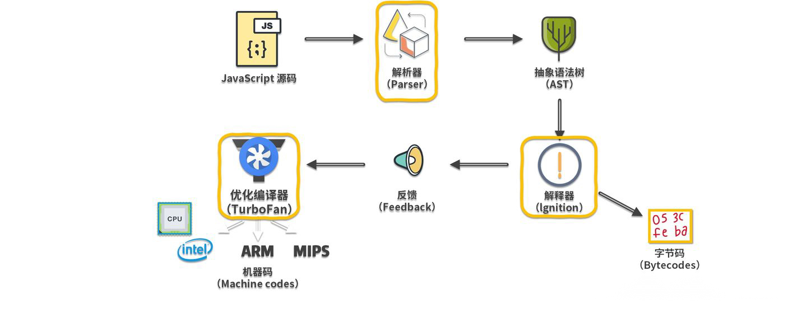
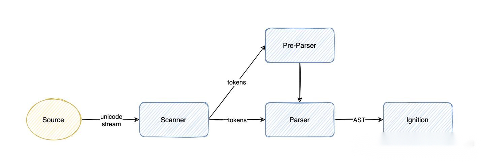

# v8引擎

## v8引擎出现的原因
编译型语言： 在程序执行之前必须进行专门的编译过程，有如下特点：
```
只须编译一次就可以把源代码编译成机器语言，后面的执行无须重新编译，直接使用之前的编译结果就可以；因此其执行的效率比较高；
编译性语言代表：C、C++、Java、Pascal/Object Pascal（Delphi）；
程序执行效率比较高，但比较依赖编译器，因此跨平台性差一些；
不同平台对编译器影响较大。
    16位系统下int是2个字节（16位），而32位系统下int占4个字节（32位）；
    32位系统下long类型占4字节，而64位系统下long类型占8个字节；
```

解释性语言 - 解释行语言，支持动态类型，弱类型，在程序运行的时候才进行编译，而编译前需要确定变量的类型，效率比较低，对不同系统平台有较大的兼容性.
```
源代码不能直接翻译成机器语言，而是先翻译成中间代码，再由解释器对中间代码进行解释运行；
    源代码—>中间代码—>机器语言
程序不需要编译，程序在运行时才翻译成机器语言，每执行一次都要翻译一次；
解释性语言代表：Python、JavaScript、Shell、Ruby、MATLAB等；
运行效率一般相对比较低，依赖解释器，跨平台性好；
```

比较：
```
一般，编译性语言的运行效率比解释性语言更高；但是不能一概而论，部分解释性语言的解释器通过在运行时动态优化代码，甚至能使解释性语言的性能超过编译性语言；
编译性语言的跨平台特性比解释性语言差一些；
```

经过以上说明，解释性语言，运行效率低，随着Web相关技术的发展，JavaScript所要承担的工作也越来越多，早就超越了“表单验证”的范畴，这就更需要快速的解析和执行JavaScript脚本。V8引擎就是为解决这一问题而生，在node中也是采用该引擎来解析JavaScript。

## JavaScript引擎
JavaScript本质上是一种解释型语言，与编译型语言不同的是它需要**一边执行一边解析**，而编译型语言在执行时已经完成编译，可直接执行，有更快的执行速度(如上图所示)。JavaScript代码是在浏览器端解析和执行的，如果需要时间太长，会影响用户体验。那么提高JavaScript的解析速度就是当务之急。

JavaScript语言是解释型语言，为了提高性能，引入了Java虚拟机和C++编译器中的众多技术。现在JavaScript引擎的执行过程大致是:

源代码-→抽象语法树-→字节码-→JIT-→本地代码(V8引擎没有中间字节码)。

V8更加直接的将抽象语法树通过JIT技术转换成本地代码，放弃了在字节码阶段可以进行的一些性能优化，但保证了执行速度。在V8生成本地代码后，也会通过Profiler采集一些信息，来优化本地代码。虽然，少了生成字节码这一阶段的性能优化，但极大减少了转换时间。

但是在2017年4月底，v8 的 5.9 版本发布了，新增了一个 Ignition 字节码解释器，将默认启动，从此之后将与JSCore有大致相同的流程。做出这一改变的原因为：（主要动机）减轻机器码占用的内存空间，即牺牲时间换空间；提高代码的启动速度；对 v8 的代码进行重构，降低 v8 的代码复杂度

## V8引擎
- V8引擎是一个JavaScript引擎实现，最初由一些语言方面专家设计，后被谷歌收购，随后谷歌对其进行了开源。
- V8使用C++开发，在运行JavaScript之前，相比其它的JavaScript的引擎转换成字节码或解释执行，V8将其编译成原生机器码（IA-32, x86-64, ARM, or MIPS CPUs），并且使用了如内联缓存（inline caching）等方法来提高性能。
- 有了这些功能，JavaScript程序在V8引擎下的运行速度媲美二进制程序。
- V8支持众多操作系统，如windows、linux、android等，也支持其他硬件架构，如IA32,X64,ARM等，具有很好的可移植和跨平台特性。

2017 年，V8 正式发布全新编译 pipeline，即用 Ignition 和 TurboFan 的组合，来编译执行代码，从 V8 5.9 版开始，早期的 Full-Codegen 和 Crankshaft 编译器不再用来执行 JavaScript。

其中，最核心的是三个模块：

- 解析器（Parser）
- 解释器（Ignition）
- 优化编译器（TurboFan）



## V8 怎么执行 JavaScript 代码的
当 V8 执行 JavaScript 源码时，首先解析器会把源码解析为抽象语法树（Abstract Syntax Tree），解释器（Ignotion）再将 AST 翻译为字节码，一边解释一边执行。

在此过程中，解释器会记特定代码片段的运行次数，如果代码运行次数超过某个阈值，那么该段代码就被标记为热代码（hot code），并将运行信息反馈给优化编译器（TurboFan）。

优化编译器根据反馈信息，优化并编译字节码，最终生成优化后的机器码，这样当该段代码再次执行时，解释器就直接使用优化机器码执行，不用再次解释，大大提高了代码运行效率。

这种在运行时编译代码的技术也被称为 JIT（即时编译），通过JIT可以极大提升 JavaScript 代码的执行性能。

## 解析器如何把源码转换成 AST
要让 V8 执行我们编写的源码，就要将源码转换成 V8 能理解的格式。

V8 会先把源码解析为一个抽象语法树（AST），这是用来表示源码的树形结构的对象，这个过程称为解析（Parsing），主要由 V8 的 Parser 模块实现。然后， V8 的解释器会把 AST 编译为字节码，一边解释一边执行。

解析和编译过程的性能非常重要，因为 V8 只有等编译完成后才能运行代码。


整个解析过程可分为两部分。

1. 词法分析：将字符流转换为 tokens，字符流就是我们编写的一行行代码，token 是指语法上不能再分割的最小单位，可能是单个字符，也可能是字符串，图中的 Scanner 就是 V8 的词法分析器。
2. 语法分析：根据语法规则，将 tokens 组成一个有嵌套层级的抽象语法结构树，这个树就是 AST，在此过程中，如果源码不符合语法规范，解析过程就会终止，并抛出语法错误。图中的 Parser 和 Pre-Parser 都是 V8 的语法分析器。

## V8 执行 JavaScript 的原理总结
1. 解析器将 JavaScript 源码解析为 AST，解析过程分为词法分析和语法分析，V8 通过预解析提升解析效率；
2. 解释器 Ignition 根据 AST 生成字节码并执行。这个过程中会收集执行反馈信息，交给 TurboFan 进行优化编译；
3. TurboFan 根据 Ignition 收集的反馈信息，将字节码编译为优化后的机器码，后续 Ignition 用优化机器码代替字节码执行，进而提升性能。

## V8 VS JavaScriptCore
JavaScriptCore引擎是WebKit中默认的JavaScript引擎，也是苹果开源的一个项目，应用较为广泛。最初，性能不是很好，从2008年开始了一系列的优化，重新实现了编译器和字节码解释器，使得引擎的性能有较大的提升。随后内嵌缓存、基于正则表达式的JIT、简单的JIT及字节码解释器等技术引入进来，JavaScriptCore引擎也在不断的迭代和发展。

V8引擎自诞生之日起就以性能优化作为目标，引入了众多新技术，极大了带动了整个业界JavaScript引擎性能的快速发展。总的来说，V8引擎较为激进，青睐可以提高性能的新技术，而JavaScriptCore引擎较为稳健，渐进式的改变着自己的性能。

JavaScriptCore 的大致流程为：源代码-→抽象语法树-→字节码-→JIT-→本地代码。JavaScriptCore与V8有一些不同之处，其中最大的不同就是新增了字节码的中间表示，并加入了多层JIT编译器（如：简单JIT编译器、DFG JIT编译器、LLVM等）优化性能，不停的对本地代码进行优化。

还有就是在数据表示方面，V8在不同的机器上使用与机器位数相匹配的数据表示，而在JavaScriptCore中句柄都是使用64位表示，其可以表示更大范围的数字，所以即使在32位机器上，浮点类型同样可以保存在句柄中，不再需要访问堆中的数据，当也会占用更多的空间。

## 注意项
结合上面对于V8引擎的介绍，我们在编程中应注意：

- 类型。对于函数，JavaScript是一种动态类型语言，JavaScriptCore和V8都使用隐藏类和内嵌缓存来提高性能，为了保证缓存命中率，一个函数应该使用较少的数据类型；对于数组，应尽量存放相同类型的数据，这样就可以通过偏移位置来访问。
- 数据表示。简单类型数据（如整型）直接保存在句柄中，可以减少寻址时间和内存占用，如果可以使用整数表示的，尽量不要用浮点类型。
- 内存。虽然JavaScript语言会自己进行垃圾回收，但我们也应尽量做到及时回收不用的内存，对不再使用的对象设置为null或使用delete方法来删除(使用delete方法删除会触发隐藏类新建，需要更多的额外操作)。
- 优化回滚。在执行多次之后，不要出现修改对象类型的语句，尽量不要触发优化回滚，否则会大幅度降低代码的性能。
- 新机制。使用JavaScript引擎或者渲染引擎提供的新机制和新接口提高性能。