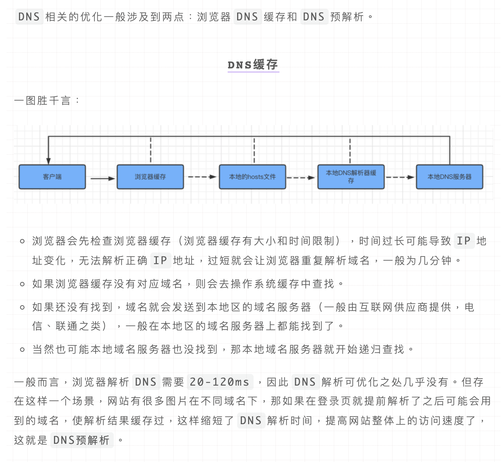
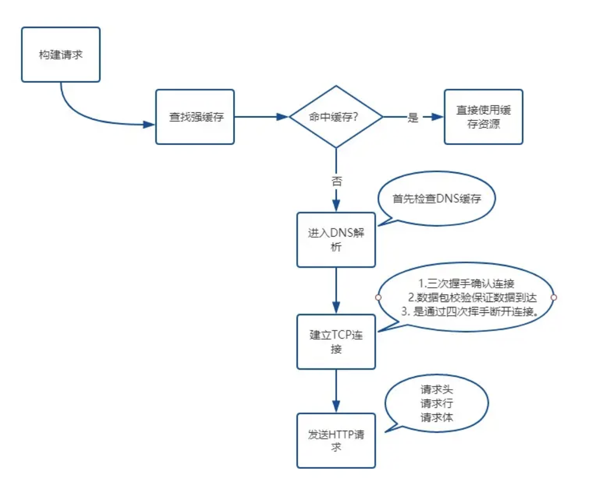
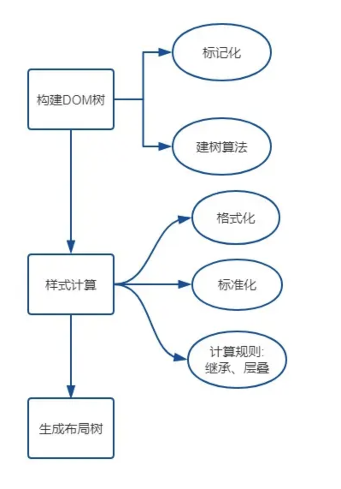
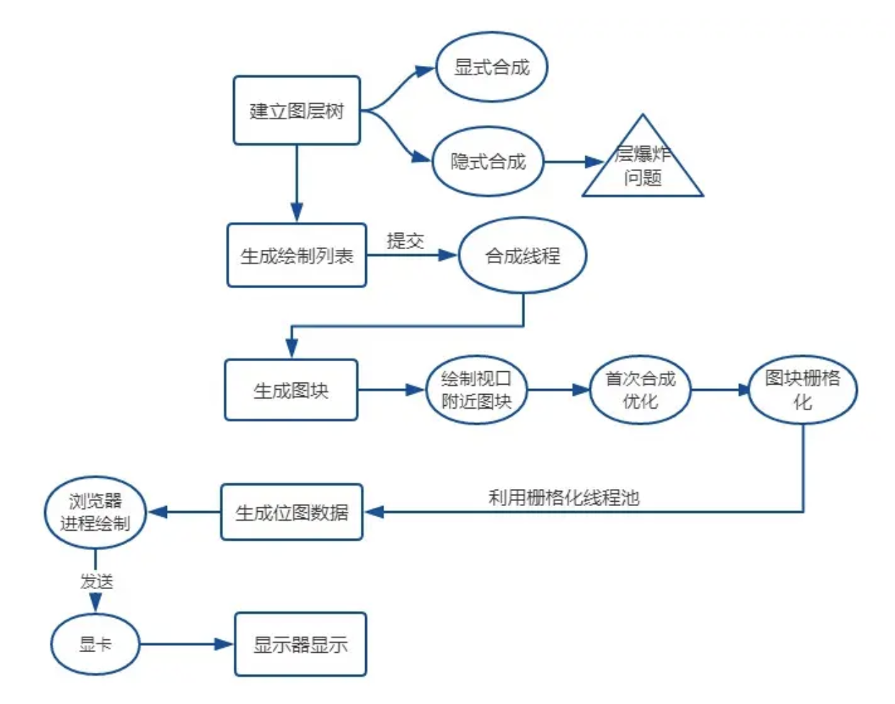

# 从输入URL到页面呈现

## 从输入URL到页面呈现发生了什么--网络篇

**1. 构建请求--浏览器会构建请求行**

**2.查找强缓存**

当浏览器发现请求的资源已经在浏览器缓存中存有副本，**它会拦截请求，返回该资源的副本，并直接结束请求，而不会再去源服务器重新下载**。

Expires => Cache-Control  从过期时间变成过期时长  max-age就是确定缓存的时间**秒**。

**3. DNS解析**（淘宝京东这种网站一般使用**DNS预解析**跨过这一步，浏览器会在加载网页时对网页中的域名进行解析缓存，这样在你单击当前网页中的连接时就无需进行DNS的解析）**（准备 IP 地址和端口）**

这个过程需要依赖一个服务系统，这个系统将域名和 IP 一一映射，我们将这个系统就叫做**DNS**（域名系统）。得到具体 IP 的过程就是`DNS`解析。浏览器提供了**DNS数据缓存功能**。即如果一个域名已经解析过，那会把解析的结果缓存下来，下次处理直接走缓存，不需要经过 `DNS解析`。

**浏览器缓存：浏览器会按照一定的频率缓存 DNS 记录。**
**操作系统缓存：如果浏览器缓存中找不到需要的 DNS 记录，那就去操作系统中找。**
**路由缓存：路由器也有 DNS 缓存。**
**互联网服务提供商 的 DNS 服务器：ISP 有专门的 DNS 服务器应对 DNS 查询请求。**
**根服务器：ISP 的 DNS 服务器还找不到的话，它就会向根服务器发出请求，进行递归查询（DNS 服务器先问根域名服务器.com 域名服务器的 IP 地址，然后再问.baidu 域名服务器，依次类推）**

之后**如果请求协议是 HTTPS，那么还需要建立 SSL/TLS 连接。**

##### 3.5等待 TCP 队列

Chrome 有个机制，**同一个域名同时最多只能请求 6 个 TCP 连接**，如果在同一个域名下同时有 10 个请求发生，那么其中 4 个请求会进入排队**等待状态**，直至进行中的请求完成。如果当前请求数量少于 6 ，会直接进入下一步，建立 TCP 连接。

**4.建立 TCP 连接**

1. 通过**三次握手**(即总共发送3个数据包确认已经建立连接)建立客户端和服务器之间的连接。
2. 进行**数据传输**。这里有一个重要的机制，就是**接收方接收到数据包后必须要向发送方`确认`, 如果发送方没有接到这个`确认`的消息，就判定为数据包丢失，并重新发送该数据包。**当然，发送的过程中还有一个优化策略，就是把`大的数据包拆成一个个小包`，依次传输到接收方，接收方按照这个小包的顺序把它们`组装`成完整数据包。
3. 断开连接的阶段。数据传输完成，现在要断开连接了，通过**四次挥手**来断开连接。

读到这里，你应该明白 TCP 连接通过什么手段来保证数据传输的可靠性，**一是`三次握手`确认连接，二是`数据包校验`保证数据到达接收方，三是通过`四次挥手`断开连接。**

**5.发送 HTTP 请求**

浏览器发 HTTP 请求要携带三样东西:**请求行**、**请求头**和**请求体**。

**6.网络响应**

网络响应具有三个部分:**响应行**、**响应头**和**响应体**。

如果请求头或响应头中包含**Connection: Keep-Alive**，表示建立了持久连接，这样`TCP`连接会一直保持，之后请求统一站点的资源会复用这个连接。

否则断开`TCP`连接, 请求-响应流程结束。

默认情况下，Chrome 会为每个页面分配一个渲染进程。

## 从输入URL到页面呈现发生了什么--解析算法篇

**浏览器解析：1.构建 DOM树 =>2.样式计算 =>3.生成布局树**

大厂网站首屏优化：将**首屏内容静态化在html里面**，直接**解析DOM时渲染出来**

紧邻首屏的内容，如果不能包含在html中静态化，那么可以让在在页面渲染后，立刻执行**异步获取数据**

### 构建 DOM 树

**输入 HTML 文件，然后经由 HTML 解析器解析，最终输出保存在内存中树状结构 DOM。**

由于浏览器无法直接理解`HTML字符串`，因此将这一系列的**字节流转换为一种有意义并且方便操作的数据结构，这种数据结构就是`DOM树`**。`DOM树`本质上是一个以`document`为根节点的多叉树。

（1.先浏览器从磁盘或网络中读取 `HTML` 原始字节，并根据文件的指定编码将它们转成字符。

2.通过分词器将字节流转换为 `Token`，在`Token`（也就是令牌）生成的同时，另一个流程会同时消耗这些令牌并转换成 `HTML head` 这些节点对象，起始和结束令牌表明了节点之间的关系。

3.当所有的令牌消耗完以后就转换成了`DOM`（文档对象模型）。

构建 CSSOM 树流程类似，之后渲染引擎就会构造布局树并过滤不需要显示的元素。）

#### 解析算法 1.标记化 2.建树

##### 标记化算法

这个算法输入为`HTML文本`，输出为`HTML标记`，也成为**标记生成器**。其中运用**有限自动状态机**来完成。即在当当前状态下，接收一个或多个字符，就会更新到下一个状态。

##### 建树算法

之前提到过，DOM 树是一个以`document`为根节点的多叉树。因此解析器首先会创建一个`document`对象。标记生成器会把每个标记的信息发送给**建树器**。**建树器**接收到相应的标记时，会**创建对应的 DOM 对象**。创建这个`DOM对象`后会做两件事情:

1. 将`DOM对象`加入 DOM 树中。
2. 将对应标记压入存放开放(与`闭合标签`意思对应)元素的栈中。

### 样式计算

**3种来源：link标签引用 style标签中的样式 元素的内嵌style属性**

**格式化样式表（document.styleSheets） => 标准化样式属性 比如：blue->rgb(0,0,255) => 计算每个节点的具体样式 => 生成布局树**

## 从输入URL到页面呈现发生了什么——渲染过程篇

- **1.建立图层树**
- **2.生成绘制列表** -- 渲染引擎
- 3.绘制：**生成图块和生成位图并栅格化** -- 渲染引擎中的合成线程
- **4.显示器显示内容**

### 一、建图层树

**渲染引擎还需要为特定的节点生成专用的图层，并生成一棵对应的图层树。**(两种方式)

通常情况下，并不是布局树的每个节点都包含一个图层，如果一个节点没有对应的层，那么这个节点就从属于父节点的图层。

#### 显示合成

一、 拥有**层叠上下文属性的元素**的节点。

二、需要**剪裁**的地方。

#### 隐式合成

简单来说就是`层叠等级低`的节点被提升为单独的图层之后，那么`所有层叠等级比它高`的节点**都会**成为一个单独的图层。可能发生层爆炸。

### 二、生成绘制列表

**渲染引擎**会将**图层的绘制拆分成一个个绘制指令**，比如先画背景、再描绘边框......然后将这些指令按顺序组合成一个待绘制列表，相当于给后面的绘制操作做了一波计划。

### 三、生成图块和生成位图

绘制列表只是用来记录绘制顺序和绘制指令的列表，而实际上**绘制操作是由渲染引擎中的合成线程**来完成的。

当图层的绘制列表准备好之后，主线程会把该绘制列表提交给合成线程，**合成线程会将图层划分为图块**，然后合成线程会**按照视口附近的图块来优先生成位图**，实际生成位图的操作是由栅格化来执行的。所谓栅格化，是指将图块转换为位图。而图块是栅格化执行的最小单位。**渲染进程维护了一个栅格化的线程池，所有的图块栅格化都是在线程池内执行的。**

生成位图的过程实际上都会使用 **GPU 进行加速**，**生成的位图最后发送给合成线程**。

### 四、显示器显示内容

栅格化操作完成后，**合成线程**会生成一个绘制命令，即"DrawQuad"，并发送给浏览器进程。

浏览器进程中的`viz组件`接收到这个命令，根据这个命令，把**页面内容绘制到内存**，最后再将内存显示在**屏幕**上。

