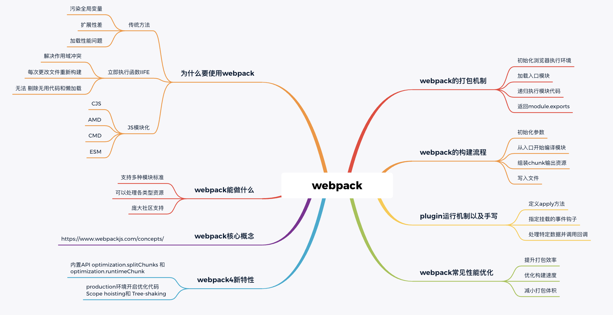
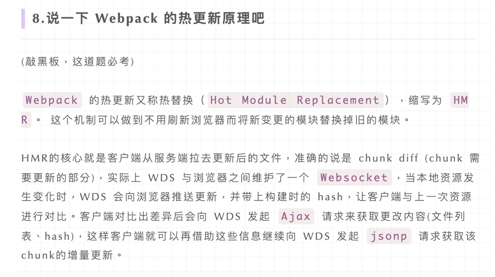

# Webpack相关

## webpack大纲

## Loader和Plugin的区别

`Loader` 本质就是一个函数，**在该函数中对接收到的内容进行转换，返回转换后的结果。** 因为 Webpack 只认识 JavaScript，所以 Loader 就成了翻译官，对其他类型的资源进行转译的预处理工作。

**css-loader** 将@import 和 url 处理成正规的ES6 import 使css文件模块化

**style-loader** 会将输出的css注入到打包文件中 （通过DOM操作将之前导出内容中的样式插入到style标签中）

**postcss-loader** 添加浏览器前缀

`Plugin` 就是插件，基于事件流框架 `Tapable`，**插件可以扩展 Webpack 的功能**，**在 Webpack 运行的生命周期中会广播出许多事件，Plugin 可以监听这些事件，在合适的时机通过 Webpack 提供的 API 改变输出结果。**

### 在webpack的plugin运行的过程中存在两个非常重要的对象：`compiler`和`compilation`。

- compiler：在初始化compiler对象之后，通过调用插件实例的apply方法，作为其参数传入。这个对象包含了webpack环境的所有的配置信息，比如options，loaders，plugins等。这个对象会在webpack被启动的时候进行实例化，全局且唯一的。

- compilation：这个对象会作为plugin内置事件回调函数的参数。包含了当前的模块资源，编译生成的资源，变化的文件等信息。如果我们运行在开发模式，每当检测到一个文件的变化，就会生成一个新的compilation对象。

所以，compiler代表了webpack从启动到关闭的整个生命周期，而compilation仅仅代表了一次新的编译。

## 构建流程
1. **初始化参数**：从配置文件和 Shell 语句中读取与合并参数,得出最终的参数。
2. **开始编译**：用上一步得到的参数初始化 Compiler 对象,加载所有配置的插件,执行对象的 run 方法开始执行编译。
3. **确定入口**：根据配置中的 entry 找出所有的入口文件。
4. **编译模块**：从入口文件出发,调用所有配置的 Loader 对模块进行翻译,再找出该模块依赖的模块,再递归本步骤直到所有入口依赖的文件都经过了本步骤的处理。
5. **完成模块编译**：在经过第 4 步使用 Loader 翻译完所有模块后,得到了每个模块被翻译后的最终内容以及它们之间的依赖关系。
6. **输出资源**：根据入口和模块之间的依赖关系,组装成一个个包含多个模块的 Chunk,再把每个 Chunk 转换成一个单独的文件加入到输出列表,这步是可以修改输出内容的最后机会。
7. **输出完成**：在确定好输出内容后,根据配置确定输出的路径和文件名,把文件内容写入到文件系统。

**在以上过程中,Webpack 会在特定的时间点广播出特定的事件,插件在监听到感兴趣的事件后会执行特定的逻辑,并且插件可以调用 Webpack 提供的 API 改变 Webpack 的运行结果。**

## **提高效率的插件**

**`webpack-dashboard`：可以更友好的展示相关打包信息。**

**`webpack-merge`：提取公共配置，减少重复配置代码**

**`speed-measure-webpack-plugin`：简称 SMP，分析出 Webpack 打包过程中 Loader 和 Plugin 的耗时，有助于找到构建过程中的性能瓶颈。**

**`size-plugin`：监控资源体积变化，尽早发现问题**

**`webpack-bundle-analyzer` 生成 `bundle` 的模块组成图，显示所占体积。**

**`HotModuleReplacementPlugin`：模块热替换**

**`NamedModulesPlugin`**：**显示热替换模块文件名称**

webpack 的一些优化手段，**打包时间方面、缓存、缩小构建目标**

## 打包体积

**打包体积优化，减少首次访问白屏时间**：按需加载 **code-splitting 代码切割**：需要使用 `import()` 语法：`import()` 语法，需要 `@babel/plugin-syntax-dynamic-import` 的插件支持，但是因为当前 `@babel/preset-env` 预设中已经包含了 `@babel/plugin-syntax-dynamic-import`，因此我们不需要再单独安装和配置。

**1缩小构建目标**：**externals配置**：防止**将某些 `import` 的包(package)**打包到 bundle 中，而是在运行时(runtime)再去从外部获取这些扩展依赖(external dependencies) --- **CDN引入**。

**2缩小构建目标**：页面公共资源：使用 SplitChunksPlugin 进行(公共脚本、基础包、页面公共文件)分离(Webpack4内置) ，替代了 CommonsChunkPlugin 插件

**3缩小构建目标**：**使用Tree Shaking**：ES6 模块化语法是静态的，可以静态分析=>需要使用**UglifyJsPlugin**插件

## 构建速度

**1优化构建速度： 使用 DllPlugin**：**DLLPlugin 和 DLLReferencePlugin 用某种方法实现了拆分 bundles，同时还大大提升了构建的速度。**

**DllPlugin配置一份webpack配置文件，用于生成动态链接库。**第一次使用 webpack.dll.config.js 文件会对第三方库打包，打包完成后就不会再打包它了，然后每次运行 webpack.config.js文件的时候，都会打包项目中本身的文件代码，当需要使用第三方依赖的时候，会**使用 DllReferencePlugin插件去读取第三方依赖库**，**看看是否有该第三方库**。所以说它的打包速度会得到一个很大的提升。）

**2优化构建速度：使用 HappyPack或thread-loader**：Webpack 是单线程模型的，也就是说 Webpack 需要一个一个地处理任务，**不能同时处理多个任务**。**HappyPack将任务分解给多个子进程去并发执行**，子进程处理完后再将结果发送给主进程,从而发挥多核 CPU 电脑的威力。

**3优化构建速度：使用 ParallelUglifyPlugin**：webpack默认提供了**UglifyJS**插件来压缩JS代码，但是它使用的是单线程压缩代码，也就是说多个js文件需要被压缩，它需要一个个文件进行压缩。所以说在正式环境打包压缩代码速度非常慢(**因为压缩JS代码需要先把代码解析成用Object抽象表示的AST语法树，再去应用各种规则分析和处理AST，导致这个过程耗时非常大**)。

当webpack有**多个JS文件需要输出和压缩时候**，原来会使用UglifyJS去一个个压缩并且输出，但是ParallelUglifyPlugin插件则会**开启多个子进程**，把对多个文件压缩的工作分别给多个子进程去完成，但是每个子进程还是通过UglifyJS去压缩代码。无非就是变成了**并行处理**该压缩了，并行处理多个子任务，效率会更加的提高。

## 其他优化

图片压缩--**配置image-webpack-loader**`缩小打包作用域` --exclude/include (确定 loader 规则范围)

**cache-loader**--在一些**性能开销较大**的 loader 之前添加此 loader，以将结果缓存到磁盘里。

**IgnorePlugin**-- `webpack` 的内置插件，作用是忽略第三方包指定目录。

[webpack优化](https://juejin.cn/post/6844904071736852487)

## 热更新
