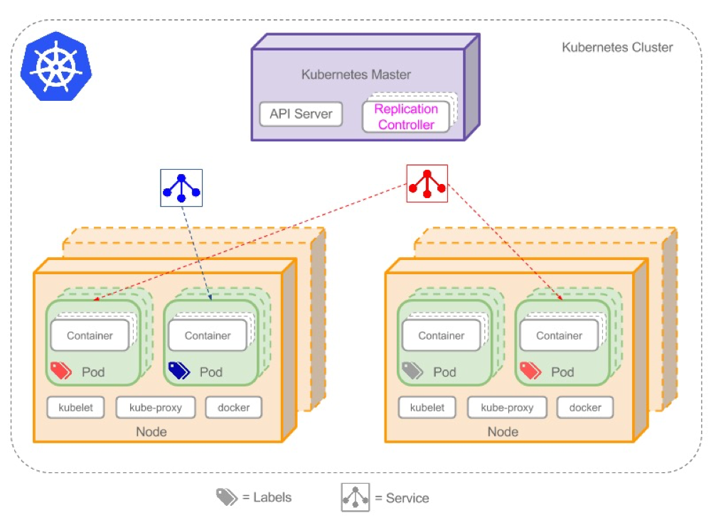

# k8s

## 什么是K8s
k8s是一个docker集群的管理工具 

k8s是容器的编排工具

Kubernetes(k8s)是Google开源的容器集群管理系统（谷歌内部:Borg），目前已经成为容器编排一个标准。在Docker技术的基础上，为容器化的应用提供部署运行、资源调度、服务发现和动态伸缩、高可用等一系列完整功能，提高了大规模容器集群管理的便捷性。

Kubernetes优势:
1. 容器编排
2. 轻量级
3. 开源
4. 弹性伸缩
5. 负载均衡

## k8s核心概念

### 集群
在集群管理方面，K8s将集群中的机器划分为一个Master节点和一群工作节点Node。Master节点上运行着集群管理相关的一组进程kube-apiserver、kube-controller-manager和kube-scheduler。这些进程自动化实现了整个集群的资源管理、Pod调度、弹性伸缩、安全控制、系统监控和纠错等管理功能。

k8s集群由Master节点和Node（Worker）节点组成。
### Master节点
Master节点指的是集群控制节点，管理和控制整个集群，基本上k8s的所有控制命令都发给它，它负责具体的执行过程。在Master上主要运行着：

1. Kubernetes Controller Manager（kube-controller-manager）：k8s中所有资源对象的自动化控制中心，维护管理集群的状态，比如故障检测，自动扩展，滚动更新等。
2. Kubernetes Scheduler（kube-scheduler）： 负责资源调度，按照预定的调度策略将Pod调度到相应的机器上。
3. etcd：保存整个集群的状态。

### Node节点
除了master以外的节点被称为Node或者Worker节点，可以在master中使用命令 kubectl get nodes查看集群中的node节点。每个Node都会被Master分配一些工作负载（Docker容器），当某个Node宕机时，该节点上的工作负载就会被Master自动转移到其它节点上。在Node上主要运行着：

1. kubelet：负责Pod对应的容器的创建、启停等任务，同时与Master密切协作，实现集群管理的基本功能
2. kube-proxy：实现service的通信与负载均衡
3. docker（Docker Engine）：Docker引擎，负责本机的容器创建和管理

### Pod
Pod是K8s最重要也是最基础的概念！每个Pod都有一个特殊的被称为“根容器”的Pause容器，此容器与引入业务无关并且不易死亡。且以它的状态代表整个容器组的状态！Pause容器对应的镜像属于K8s平台的一部分，除了Pause容器，每个Pod还包含一个或多个用户业务容器。Pod其实有两种类型：普通的Pod及静态Pod（static Pod）,static Pod并不存放在Kubemetes的eted存储里，而是存放在某个具体的Node上的一个具体文件中，并且只在此Node上启动运行。而普通的Pod一旦被创建，就会被放入到etcd中存储，确后会被KubernetesMaster调度到某个具体的Node上并进行绑定（Binding），随后该Pod被对应的Node上的kubelet进程实例化成一组相关的Docker容器并启动起来。在默认情况下，当Pod里的某个容器停止时，Kubemetes会自动检测到这个问题并且重新启动这个Pod（重启Podel）的所有容器），如果Pod所在的Node完机，则会将这个Node上的所有Pod重新调度到其他节点上。Pod安排在节点上，包含一组容器和卷。同一个Pod里的容器共享同一个网络命名空间，可以使用localhost互相通信。

## 过程原理
1. 用户通过kubectl提交需要运行的docker container(pod);
2. master节点的api server把请求存储在etcd数据库中;
3. scheduler调度器进行扫描 ,将合适的node节点机器分配出去;
4. node节点的kublet找到自己要跑的container,在本机上运行

## k8s的核心功能
**自愈**: 重新启动失败的容器，在节点不可用时，替换和重新调度节点上的容器，对用户定义的健康检查不响应的容器会被中止，并且在容器准备好服务之前不会把其向客户端广播。

**弹性伸缩**: 通过监控容器的cpu的负载值,如果这个平均高于80%,增加容器的数量,如果这个平均低于10%,减少容器的数量

**服务的自动发现和负载均衡**: 不需要修改您的应用程序来使用不熟悉的服务发现机制,Kubernetes 为容器提供了自己的 IP 地址和一组容器的单个DNS 名称，并可以在它们之间进行负载均衡。

**滚动升级和一键回滚**: Kubernetes 逐渐部署对应用程序或其配置的更改，同时监视应用程序运行状况，以确保它不会同时终止所有实例。 如果出现问题，Kubernetes会为您恢复更改，利用日益增长的部署解决方案的生态系统。

**私密配置文件管理**: web容器里面,数据库的账户密码(测试库密码)