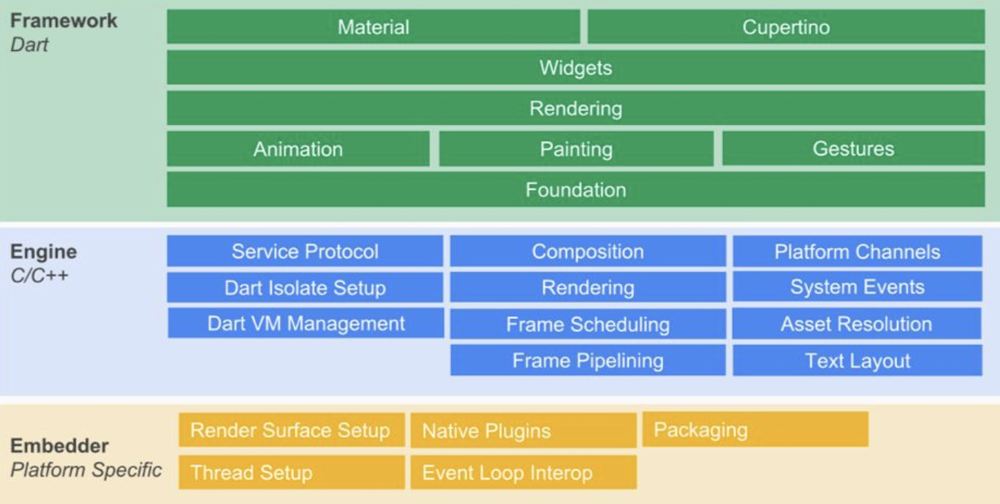
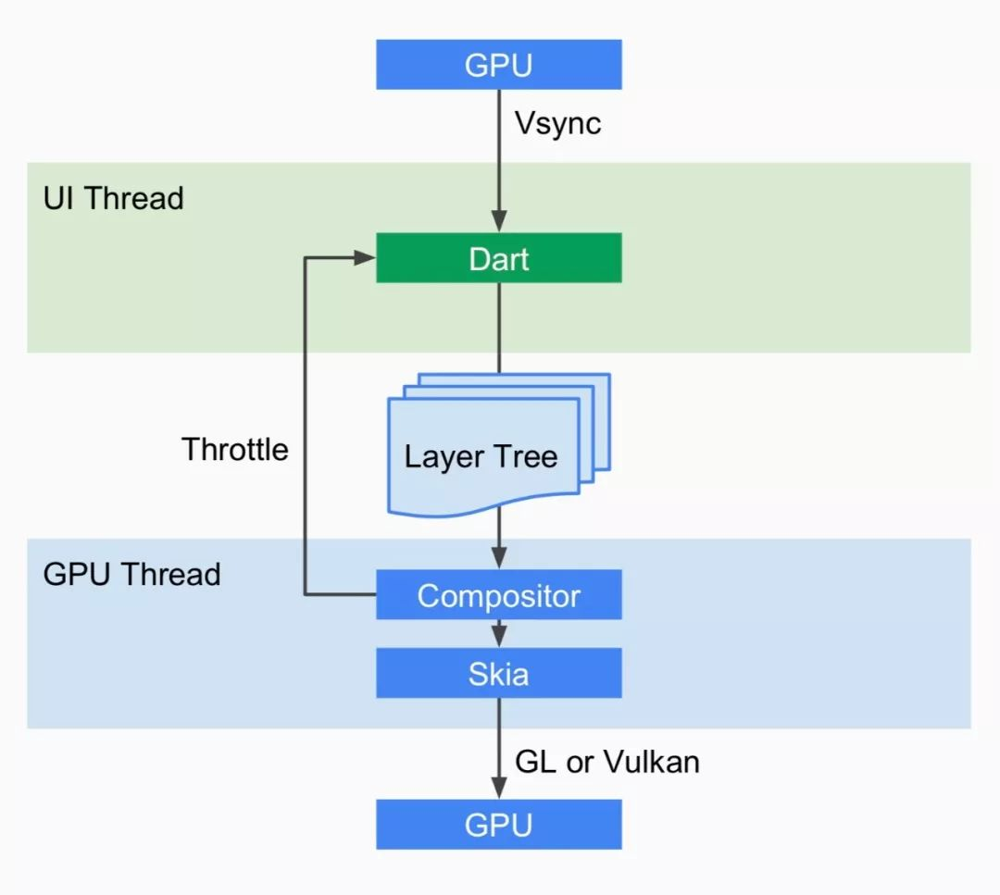

# 核心原理

Flutter是由Google推出的开源的高性能跨平台框架，一个2D渲染引擎。在Flutter中，Widget是Flutter用户界面的基本构成单元，可以说一切皆Widget。下面来看下Flutter框架的整体结构组成。

## 基本架构
Flutter 的架构主要分成三层:Framework，Engine 和 Embedder。

**Flutter Framework**

纯 Dart实现的 SDK，类似于 React在 JavaScript中的作用。它实现了一套基础库， 用于处理动画、绘图和手势。并且基于绘图封装了一套 UI组件库，然后根据 Material 和Cupertino两种视觉风格区分开来。这个纯 Dart实现的 SDK被封装为了一个叫作 dart:ui的 Dart库。我们在使用 Flutter写 App的时候，直接导入这个库即可使用组件等功能。

**Flutter Engine**

纯 C++实现的 SDK，其中包括 Skia引擎、Dart运行时、文字排版引擎等。它是 Dart的一个运行时，它可以以 JIT 或者 AOT的模式运行 Dart代码。这个运行时还控制着 VSync信号的传递、GPU数据的填充等，并且还负责把客户端的事件传递到运行时中的代码。

**Embedder**

一个嵌入层，即把 Flutter 嵌入到各个平台上去，这里做的主要工作包括渲染 Surface 设置，线程设置，以及插件等。从这里可以看出，Flutter 的平台相关层很低，平台(如 iOS)只是提供一个画布，剩余的所有渲染相关的逻辑都在 Flutter 内部，这就使得它具有了很好的跨端一致性。

## 绘图原理

屏幕显示器一般以60Hz的固定频率刷新，每一帧图像绘制完成后，会继续绘制下一帧，这时显示器就会发出一个Vsync信号，按60Hz计算，屏幕每秒会发出60次这样的信号。CPU计算好显示内容提交给GPU，GPU渲染好传递给显示器显示。

GPU的VSync信号同步给到UI线程，UI线程使用Dart来构建抽象的视图结构（这里是Framework层的工作，后面会进行详细讲解），绘制好的抽象视图数据结构在GPU线程中进行图层合成（在Flutter Engine层的工作），然后提供给Skia引擎渲染为GPU数据，最后通过OpenGL或者 Vulkan提供给 GPU。

## Flutter 和 Native 的通信

Flutter定义了三种Channel，分别为：

1. BasicMessageChannel：用于传递字符串和半结构化的信息。
2. MethodChannel：用于传递方法调用（method invocation）。
3. EventChannel: 用于数据流（event streams）的通信。

具体和Native间的消息传递，是通过MethodChannel完成的。MethodChannel入参为name和MethodCodec参数，name为MethodChannel的标识，而MethodCodec是个消息编/解码器，当我们使用 invokeMethod 发起一次方法调用时，就开始了消息传递，invokeMethod 会将其入参message和arguments封装成一个MethodCall对象，并使用MethodCodec将其编码为二进制格式数据，再通过BinaryMessages将消息发到Platform。结果回传时，Platform端会将二进制结果转化为Dart的二进制数据类型，通过回调传递给Dart层。Dart接收到二进制结果后，再使用MethodCodec将数据解码，传回到上层业务，至此，一次完成的消息传递就结束了。