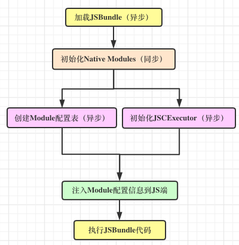

# 启动流程

## RN启动的入口

ReactNative 启动是从创建一个 RCTRootView 作为入口视图容器开始运作的，创建 RCTRootView 时，会先创建一个 JSBridge 作为 Native 端与 JS 端交互的桥梁。整个 RN 的启动工作基本都是在创建 JSBridge 时做的。

JSBridge 的核心是 RCTBatchedBridge 的，JSBridge 的工作主要在 RCTBatchedBridge 初始化中处理。启动流程采用 GCD 来进行多线程操作，其中大部分耗时操作是在并发队列com.facebook.react.RCTBridgeQueue中进行的。

## RN启动的准备工作
RCTBatchedBridge 启动主要进行六个准备工作：

JSBridge的初始化就是从加载js源代码（JSBundle）到JSBundle能被原生端执行，需要做什么准备工作。首先，ReactNative的js组件及事件最后都会映射成原生组件，而所有原生组件暴露给 JavaScript 的类都在Native Modules里。那么，js端是怎么映射到原生组件的呢？是通过Module 配置表 找到Native Modules里对应的类的。最后，js调用原生方法等交互，及映射成原生代码都是通过JSCExecutor。

### 1.加载 JSBundle 代码（并行队列异步执行）
将 JavaScript 源码加载到内存中，方便之后注入和执行，这一步中，React 中的 JSX 语法已经转换成 JavaScript。

### 2.初始化 Native Modules（同步执行）
同步初始化所有不能被懒惰加载的供 JS 端调用的 Native 模块。Native Modules：所有Native需要暴露给 JS 的类

### 3.初始化 JSCExecutor（与第4步在同一并行队列同时执行）
JSCExecutor 是JavaScriptCore引擎，负责JS端和Native端的通信
1.初始化时，创建一个优先级跟主线程优先级同级的单独的 JS 线程，同时创建一个 Runloop，让 JS 线程能循环执行不会退出。

2.初始化时，通过 JavaScriptCore 作为引擎，创建 JS 执行的上下文环境，并向 JS 上下文中注入 JS 与 Native 通信的方法。其中，在 Native 端实现的供 JS 端调用的几个重要方法:

nativeRequireModuleConfig：js 获取 native module 配置表。RN 并没有保存整个的 Native 方法配置表，而仅仅保存了模块的名字。这个回调就是 JS 每次根据 module 名可以查到这个 module 的模块配置信息

nativeFlushQueueImmediate： js 触发 native 进行队列消息处理。一般来说 JS 并不会主动调用 Native 的方法，而是等着 Native 定时器每隔一段时间到 JS 的 eventQueue 中去取，取出来以后批量执行。而 nativeFlushQueueImmediate 就是让 JS 直接调用 Native 的方法而不用等待。

nativeCallSyncHook：同步调用

### 4.创建 Module 配置表（与第3步在同一并行队列同时执行）
Module 配置表:

1、把所有模块信息集中收集起来，保存到一个数组中，经过序列化后，注入到JS中。

2、JS 端通过 Native 端注入的 nativeRequireModuleConfig 方法，根据 module 名可以查询该模块配置信息。

创建 Module 配置表，与初始化 JSCExecutor 的操作一起被加入并发队列com.facebook.react.RCTBridgeQueue异步进行。获取 moduleConfig 时，会根据设置不同的 executorClass，收集的模块信息会有区别，如果是RCTJSCExecutor类型，Native 端只保存模块的名字，JS 端通过 Native 端注入的nativeRequireModuleConfig方法，根据 module 名可以查到这个 module 的模块配置信息。如果不是RCTJSCExecutor类型，通过moduleData.config 链接到[RCTModuleData config]，会把 module 名、常量、函数等 native module 的配置信息都保存起来。

### 5.注入 Module 配置信息到 JSCExecutor（第3、4步执行完再执行）
当 初始化 JSCExecutor 和 创建 Module 配置表 都准备好后，会将 module 的模块配置信息注入 JS 端。

### 6.执行 JSBundle 代码（前5步都执行完再执行）
以上五步操作都执行完成后，执行 JSBundle 中的 JavaScript 源码。至此，JavaScript 和 Objective-C 都具备了向对方交互的能力，启动流程的准备工作算是全部完成了。