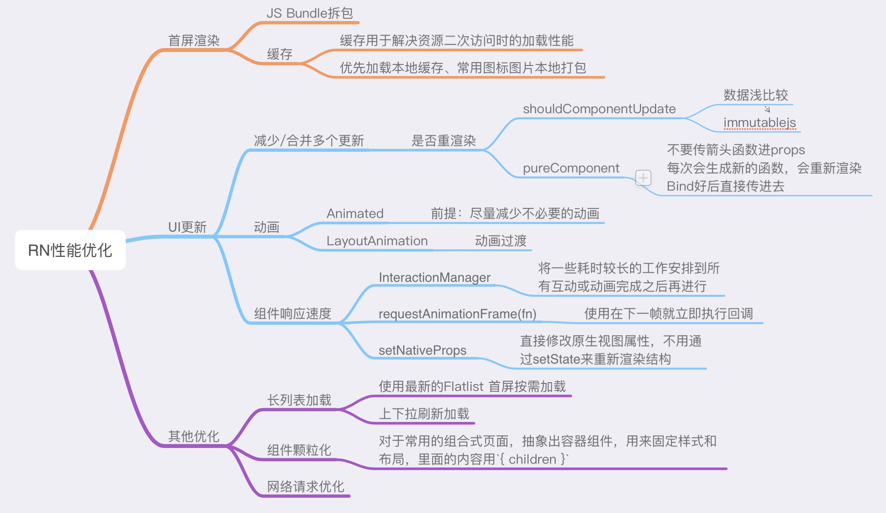

# RN性能优化

## RN启动优化
### 1. Hermes引擎

支持直接加载字节码，省掉jsEngine解析编译JS的时间，JS 代码的加载速度将会大大加快

### 2. JS Bundle

#### 2.1 减小 JS Bundle 体积

对于同样的功能，优先选择体积更小的第三方库

利用 babel 插件，避免全量引用

制定编码规范，减少重复代码

#### 2.2 Inline Requires 懒执行（延迟运行）

其实 Inline Requires 的原理非常简单，就是把 require 导入的位置改变了一下。使用时在加载。（Metro 打包 JS 时，会把 ESM 模块转为 CommonJS 模块）

#### 2.3 JSBundle 分包加载

将共有库打包到一个common.bundle文件里，每次只要动态下发业务包，然后再客户端实现先加载 common.bundle 文件，再加载 business.bundle 文件就可以了。

common.bundle 可以直接放在本地，省去多业务线的多次下载，节省流量和带宽

可以在 RN 容器预初始化的时候就加载 common.bundle ，二次加载的业务包体积更小，初始化速度更快

2.3.1 JS Bundle 拆包

拆包之前要先了解一下 Metro 这个打包工具的工作流程。Metro 的打包流程很简单，只有三个步骤：

Resolution：可以简单理解为分析各个模块的依赖关系，最后会生成一个依赖图

Transformation：代码的编译转换，主要是借助 Babel 的编译转换能力

Serialization：所有代码转换完毕后，打印转换后的代码，生成一个或者多个 bundle 文件

从上面流程可以看出，我们的拆包步骤只会在 Serialization 这一步。我们只要借助 Serialization 暴露的各个方法就可以实现 bundle 分包了。

**在 createModuleIdFactory 中根据文件的相对路径构建 ModuleId**

**在 processModuleFilter 中通过 moduleId 过滤在 common.bundle 里的数据**

2.3.2 Native 实现多 bundle 加载

### 3. Network 首屏加载优化

#### 3.1 DNS 缓存：提前缓存 IP 地址，跳过 DNS 寻址时间

#### 3.2 缓存复用：进入 RN 页面前，先提前请求网络数据并缓存下来，打开 RN 页面后请求网络前先检查缓存数据，如果缓存未过期，直接从本地缓存里拿数据

#### 3.3 请求合并：如果还在用 HTTP/1.1，若首屏有多个请求，可以合并多个请求为一个请求

#### 3.4 HTTP2：利用 HTTP2 的并行请求和多路复用优化速度

#### 3.5 减小体积：去除接口的冗余字段，减少图片资源的体积等等

### 4.Render

渲染这里的耗时，基本上和首屏页面的 UI 复杂度成正相关。可以通过渲染流程查看哪里会出现耗时：

VDOM 计算：页面复杂度越高，JavaScript 侧的计算耗时就会越长（VDOM 的生成与 Diff）

JS Native 通讯：JS 的计算结果会转为 JSON 通过 Bridge 传递给 Native 侧，复杂度越高，JSON 的数据量越大，有可能阻塞 Bridge 通讯

Native 渲染：Native 侧递归解析 render tree，布局越复杂，渲染时间越长

#### 4.1 通过一定的布局技巧降低 UI 嵌套层级，降低 UI 视图的复杂度

#### 4.2 减少 re-render，直接在 JS 侧截断重绘流程，减少 bridge 通讯的频率和数据量

#### 4.3 如果是 React Native 为主架构的 APP，首屏可以直接替换为 Native View，直接脱离 RN 的渲染流程

## RN性能优化

### 1. 减少 re-render 
使用shouldComponentUpdate

React.PureComponent/React.memo React.useMemo 和 React.useCallback

### 2. 减轻渲染压力
使用 React.Fragment 避免多层嵌套

减少 GPU 过度绘制 减少背景色的重复设置 避免设置半透明颜色 圆角 阴影

### 3.动画性能优化
#### 三个线程
UI Thread：在 iOS/Android 上专门绘制 UI 的线程

JS Thread：我们写的业务代码基本都在这个线程上，React 重绘，处理 HTTP 请求的结果，磁盘数据 IO 等等

other Thread：泛指其他线程，比如说数据请求线程，磁盘 IO 线程等等

#### 优化方向
1. 减少 JS Thread 和 UI Thread 之间的异步通信

2. 尽量减少 JS Thread 侧的计算

#### 优化方法
1. 开启 useNativeDrive: true

可以预测的动画，可以使用 useNativeDrive: true 开启原生动画驱动，通过启用原生驱动，我们在启动动画前就把其所有配置信息都发送到原生端，利用原生代码在 UI 线程执行动画，而不用每一帧都在两端间来回沟通。如此一来，动画一开始就完全脱离了 JS 线程，因此此时即便 JS 线程被卡住，也不会影响到动画了。

2. 使用 setNativeProps

如果把数字存在 this.state 里， 每次滑动不可避免的要进行大量的 setState，React 端会进行大量的重绘操作，可能会引起掉帧。我们这里就可以用 setNativeProps，避免 React 端重绘，相当于直接修改 DOM 上的数字，这样可以让动画更加流畅。

3. 使用 InteractionManager

原生应用感觉如此流畅的一个重要原因就是在互动和动画的过程中避免繁重的操作。
在 React Native 里，JS 线程太忙了，啥都要干，我们可以把一些繁重的任务放在 InteractionManager.runAfterInteractions() 里，确保在执行前所有的交互和动画都已经处理完毕。

### 四、长列表性能优化
列表配置优化

ListItems 优化

## RN性能常见问题

## RN性能优化方案
