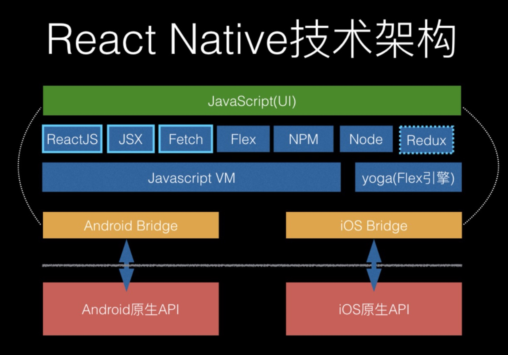

# 基本概念

## React Native 原理

### JavaScriptCore
JavaScriptCore 是 JavaScript 引擎，通常会被叫做虚拟机，专门设计来解释和执行 JavaScript 代码。在 React Native 里面，JavaScriptCore 负责 bundle 产出的 JS 代码的解析和执行。

### JS Engine
React Native 需要一个 JS 的运行环境，因为 React Native 会把应用的 JS 代码编译成一个 JS 文件（x x.bundle），React Native 框架的目标就是解释运行这个 JS 脚本文件，如果是 Native 拓展的 API，则直接通过 bridge 调用 Native 方法，最基础的比如绘制 UI 界面，映射 Virtual DOM 到真实的 UI 组件中。

## JavaScript 运行时环境
JS引擎在使用React Native时，你的JavaScript代码将会运行在两个不同的环境上：

1. 在iOS、Android的模拟器或是真机上，React Native使用的是JavaScriptCore，也就是Safari所使用的JavaScript引擎。但是在iOS上JavaScriptCore并没有使用即时编译技术（JIT），因为在iOS中应用无权拥有可写可执行的内存页（因而无法动态生成代码）。

2. 在使用Chrome调试时，所有的JavaScript代码都运行在Chrome中，并且通过WebSocket与原生代码通信。此时的运行环境是V8引擎。

## Bridge
在 React Native 中，原生端和 JavaScript 交互是通过 Bridge 进行的，Bridge 的作用就是给 React Native 内嵌的 JS Engine 提供原生接口的扩展供 JS 调用。所有的本地存储、图片资源访问、图形图像绘制、3D 加速、网络访问、震动效果、NFC、原生控件绘制、地图、定位、通知等都是通过 Bridge 封装成 JS 接口以后注入 JS Engine 供 JS 调用。理论上，任何原生代码能实现的效果都可以通过 Bridge 封装成 JS 可以调用的组件和方法, 以 JS 模块的形式提供给 RN 使用。

## RN 的 Virtual DOM
在浏览器里面，JavaScript 可以调用 DOM API 去完成创建 UI 的工作，而在 React Native 里面，是通过 UI Manager 来创建视图的，基于 Virtual DOM ，React Native 把不同平台创建视图的逻辑封装了一层，不同平台通过 Bridge 调用 UI Manager 来创建不同的 Native 视图。 

## 三个线程
在 React Native 里面，真正有三个重要的线程在执行，他们分别是 Shadow thread、UI thread 和 JS thread。
1. JS thread： 其实是 JavaScript 线程，负责 JS 和原生代码的交互线程，因为 JS 是单线程模型，所以需要一个单独的线程来驱动，并且 JS 和 Native 交互是异步的。
2. Shadow thread: 这个线程是负责 Native 布局，提供给 yoga 引擎使用。
3. UI thread：这个可以看作是主线程，可以看作是 UI Manager 线程，负责页面的交互和控件绘制逻辑。

## 热更新
React Native 的产物 bundle 文件，本质上是 JS 的逻辑代码加上 React Native 的 Runtime 的集合，所以在应用一启动的时候就会去获取 bundle 文件，之后解析 bundle 文件，最后再由 JS Engine 去执行具体的业务代码逻辑。这就可以允许开发者在云端去更新 bundle 文件，然后应用启动的时候获取最新的 bundle 文件，这一整个流程下来就实现了热更新。

## React Native 的不足
由于 React Native 和原生交互依赖的只有一个 Bridge，而且 JS 和 Native 交互是异步的，所以对需要和 Native 大量实时交互的功能可能会有性能上的不足，比如动画效率，性能是不如原生的。

React Native 始终是依赖原生的能力，所以摆脱不了对原生的依赖，相对 Flutter 的自己来画 UI 来说，React Native 显得有些尴尬。

## 新引擎 Hermes
Facebook推出了新一代JavaScript执行引擎Hermes。 Hermes 是一款小巧轻便的 JavaScript 引擎，专门针对在 Android 上运行 React Native 进行了优化。对于许多应用程序，只需启用 Hermes 即可缩短启动时间、减少内存使用量并缩小应用程序大小，此外因为它采用 JavaScript 标准实现，所以很容易在 React Native 应用中集成。

## 一些FAQs
一. RN中原生端和js端怎么进行通信的(以Android为例)？

RN通信原理简单地讲就是，一方native（java）将其部分方法注册成一个映射表，另一方（js）再在这个映射表中查找并调用相应的方法，而Bridge担当两者间桥接的角色。

其实方法调用大致分为2种情况：

Android主动向JS端传递事件、数据；
JS端主动向Android询问获取事件、数据

RN调用Android需要module名和方法名相同，而Android调用RN只需要方法名相同。
1. RCTDeviceEventEmitter 事件方式。
​ 优点：可任意时刻传递，Native主导控制。
2. Callback 回调方式。
​ 优点：JS调用，Native返回。
​ 缺点：CallBack为异步操作，返回时机不确定
3. Promise机制方式。
​ 优点：JS调用，Native返回。
​ 缺点：每次使用需要JS调用一次
4. 直传常量数据（原生向RN）。
​ 跨域传值，只能从原生端向RN端传递。RN端可通过 NativeModules.[module名].[参数名] 的方式获取。

二. 什么是JSBridge？

JSBridge是客户端和H5沟通的桥梁，通过它，我们可以获取部分原生能力，同时客户端也可以使用我们提供的一些方法。实现双向通信。

三. JSBridge的原理？

客户端可以通过webview里面注入一些javascript的上下文，可以理解为在window对象上挂载了一些方法，然后H5通过特定的对象可以获取到这个方法，反过来也是一样，js挂载了一些方法到window对象上，客户端也就可以调用js的某些方法。

四. Hermes是如何优化的？
1. 字节码预编译

在运行时解析源码转换字节码是一种时间浪费，所以Hermes选择预编译的方式在编译期间生成字节码。这样做一方面避免了不必要的转换时间，另一方面多出的时间可以用来优化字节码，从而提高执行效率。

2. 放弃JIT

为了加快执行效率，现在主流的JavaScript引擎都会使用一个JIT编译器在运行时通过转换成机器码的方式优化JS代码。但是带来的问题是1.要在启动时候预热，对启动时间有影响；2.会增加引擎size大小和运行时内存消耗；
使用AOT可以减少 Android 端内存使用，减小安装包大小，提升执行效率。

五. 设计一个RN热更新服务，需要考虑哪些地方？
1. bundle体积大的问题。打包的时候需要进行分包，使用增量更新，减少下载体积。
2. 用户的网络不稳定、网速差问题。需要用CDN加速，支持断点续传。
3. 安全性问题。
1）bundle被中间人劫持篡改。使用https下载，并按照https的加密思路，对bundle用hash算法进行签名，然后app端检验签名是否被篡改。
2）bundle下载地址被暴力攻击。检查User-Agent,只允许手机设备下载，记录设备id，在一定时间内限制下载次数。

五. RN VS flutter 有哪些区别？

1. 语言

Dart 基于 C/C++、Java、支持抽象、封装、继承和多态等特性。Flutter 团队之所以选择 Dart,是因为它与构建用户界面的方式相匹配，使用 Dart 桥接，应用程序的大小更大，但效果要快得多。与使用 JS 做桥接的 React Native 不同。

2. 原理

React Native 是一套 UI 框架，默认情况下 React Native 会在 Activity 下加载 JS 文件，然后运行在 JavaScriptCore 中解析 Bundle 文件布局，最终堆叠出一系列的原生控件进行渲染。简单来说就是 通过写 **JS 代码配置页面布局，然后 React Native 最终会解析渲染成原生控件**。

Flutter 中绝大部分的 Widget 都与平台无关， 开发者基于 Framework 开发 App ，而 Framework 运行在 Engine 之上，由 Engine 进行适配和跨平台支持。这个跨平台的支持过程，其实就是将 **Flutter UI 中的 Widget “数据化” ，然后通过 Engine 上的 Skia 直接绘制到屏幕上**。

3. 性能

由于Flutter框架中使用了C++引擎以及Skia图形库，因此与React Native相比，它能产出更高性能的应用。此外，编码过程更快，如果再深入一点，我们会发现React Native使用JavaScript桥接到本地语言。这意味着JavaScript和本地语言这两个方面交换JSON消息以建立连接，而这些消息是异步的，并且会产生非常流畅的动画，但是，这与Flutter相比，RN输出的用户界面性能可能仍然存在一些问题，例如渲染延迟。

Flutter框架没有此问题，因为它没有此桥接。它与带有内置库和诸如Material Design或Cupertino之类的框架的本机组件连接。
