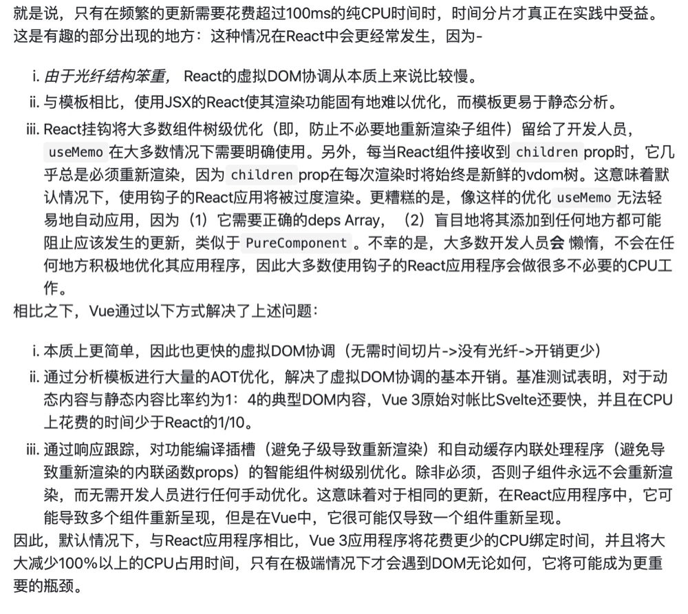

# Fiber

背景: 由于浏览器它将 GUI 描绘，时间器处理，事件处理，JS 执行，远程资源加载统统放在一起。如果执行 js 的更新， 占用了太久的进程就会导致浏览器的动画没办法执行，或者 input 响应比较慢。

react fiber 使用了 2 个核心解决思想:

- **让渲染有优先级**
- **可中断 React Fiber 将虚拟 DOM 的更新过程划分两个阶段**，reconciler 调和阶段与 commit 阶段. 

一次更新过程会分为很多个分片完成, 所以可能一个任务还没有执行完, 就被另一个优先级更高的更新过程打断, 这时候, 低优先级的工作就完全作废, 然后等待机会重头到来.

#### 调度的过程

requestIdleCallback：**首先 react 会根据任务的优先级去分配各自的过期时间**. requestIdleCallback 在每一帧的多余时间(黄色的区域)调用. 调用 channel.port1.onmessage , 先去判断当前时间是否小于下一帧时间, 如果小于则代表我们**有空余时间去执行任务**, 如果大于就去执行过期任务,如果任务没过期. 这个任务就被丢到**下一帧执行**了.由于 requestIdleCallback 的兼容性问题, react 自己实现了一个 requestIdleCallback

## Fiber架构

React Fiber是对React来说是一次革命，解决了React项目严重依赖于手工优化的痛点，**通过系统级别的时间调度，实现划时代的性能优化**。

JavaScript 是单线程运行的，同时只能做一件事情，这个和 `DOS` 的单任务操作系统一样的，事情只能一件一件的干。要是前面有一个傻叉任务长期霸占CPU，后面什么事情都干不了，浏览器会呈现卡死的状态，这样的用户体验就会非常差。对于’前端框架‘来说，解决这种问题有三个方向:

- 1️⃣ **优化每个任务，让它有多快就多快。挤压CPU运算量**
- 2️⃣ **快速响应用户**，让用户觉得够快，不能阻塞用户的交互
- 3️⃣ 尝试 **Worker 多线程**

Vue 选择的是第1️⃣, 因为对于Vue来说，使用`模板`让它有了很多优化的空间(比如静态节点的分析)，配合响应式机制可以让Vue可以精确地进行节点更新, 读者可以去看一下[今年Vue Conf 尤雨溪的演讲](https://www.yuque.com/vueconf/2019/gwn1z0)，非常棒!；而 React 选择了2️⃣ 。对于Worker 多线程渲染方案也有人尝试，要保证状态和视图的一致性相当麻烦。

为什么需要引入Fiber => **React 会递归比对VirtualDOM树，找出需要变动的节点，然后同步更新它们, 一气呵成**。(Reconcilation)，此期间React 会霸占着浏览器资源，一则会**导致用户触发的事件得不到响应, 二则会导致掉帧**，用户可以感知到这些卡顿。

**为了给用户制造一种应用很快的'假象'，我们不能让一个程序长期霸占着资源. 你可以将浏览器的渲染、布局、绘制、资源加载(例如HTML解析)、事件响应、脚本执行视作操作系统的'进程'，我们需要通过某些调度策略合理地分配CPU资源，从而提高浏览器的用户响应速率, 同时兼顾任务执行效率**。

**所以 React 通过Fiber 架构，让自己的Reconcilation 过程变成可被中断。 '适时'地让出CPU执行权，除了可以让浏览器及时地响应用户的交互，还有其他好处**:

- 与其一次性操作大量 DOM 节点相比, 分批延时对DOM进行操作，可以**得到更好的用户体验**。这个在[《「前端进阶」高性能渲染十万条数据(时间分片)》](https://juejin.im/post/5d76f469f265da039a28aff7#heading-1) 以及司徒正美的[《React Fiber架构》](https://zhuanlan.zhihu.com/p/37095662) 都做了相关实验
- 司徒正美在[《React Fiber架构》](https://zhuanlan.zhihu.com/p/37095662) 也提到：**🔴给浏览器一点喘息的机会，他会对代码进行编译优化（JIT）及进行热代码优化，或者对reflow进行修正**.

React Fiber 的思想和协程的概念是契合的: **🔴React 渲染的过程可以被中断，可以将控制权交回浏览器，让位给高优先级的任务，浏览器空闲后再恢复渲染**。

**主动让出机制** -- 通过`requestIdleCallback`实现

**设置任务优先级**

1. 数据结构的调整  栈=>链表

**Fiber 就是我们所说的工作单元，performUnitOfWork(深度优先遍历)负责对 `Fiber` 进行操作，并按照深度遍历的顺序返回下一个 Fiber**。

**因为使用了链表结构，即使处理流程被中断了，我们随时可以从上次未处理完的`Fiber`继续遍历下去**。

2.两个阶段的拆分

 **协调阶段**: 可以认为是 Diff 阶段, **这个阶段可以被中断**, 这个阶段会找出所有节点变更，例如节点新增、删除、属性变更等等, 这些变更React 称之为'`副作用`(Effect)' . 以下生命周期钩子会在协调阶段被调用：

**提交阶段**: 将上一个阶段计算出来的需要处理的**副作用(Effects)**一次性执行了。**这个阶段必须同步执行，不能被打断**. 这些生命周期钩子在提交阶段被执行:

在协调阶段如果时间片用完，React就会选择让出控制权。因为协调阶段执行的工作不会导致任何用户可见的变更，所以在这个阶段让出控制权不会有什么问题。

**更新任务还是串行执行的，我们只是将整个过程碎片化了. 对于那些需要优先处理的更新任务还是会被阻塞**。=>

**要让高优先级任务插队, 首先要保证状态更新的时序**。=>

**所有更新任务按照顺序插入一个队列, 状态必须按照插入顺序进行计算，但任务可以按优先级顺序执行**

## 关于时间切片
为什么vue3去除了时间分片？=> **如果我们可以把更新做得足够快的话，理论上就不需要时间分片了**。



Shared mutable state is the root of all evil（共享的可变状态是万恶之源）

JavaScript 中的对象一般是可变的（Mutable），因为使用了引用赋值，新的对象简单的引用了原始对象，改变新的对象将影响到原始对象。一般的做法是使用 shallowCopy（浅拷贝）或 deepCopy（深拷贝）来避免被修改，但这样做造成了 CPU 和内存的浪费。

Immutable Data是指一旦创建，就不能被更改的数据。对Immutable对象的修改都会返回新的Immutable对象。并且目前的Immutable库，都实现了结构共享，即**如果对象树中一个节点发生变化，只修改这个节点和受它影响的父节点，其它节点则进行共享，避免了deepCopy把所有节点都复制一遍带来的性能损耗。**

### 实现一个时间切片：将长任务分解成更小的任务，避免阻塞主进程。

通常同步代码执行超过 50 毫秒是一个很长的任务。长任务会阻塞主线程，导致页面卡顿，我们有两种解决方案，Web worker和Time slicing。我们应该尽量使用 web worker，但是 web worker 无法访问 DOM。所以我们需要把一个长任务拆分成小任务，分布在宏任务队列中。

```js
 function ts (gen) {
  if (typeof gen === 'function') gen = gen()
  if (!gen || typeof gen.next !== 'function') return

  return function next () {
    const start = performance.now()
    let res = null
    do {
      res = gen.next()
    } while(!res.done && performance.now() - start < 25);

    if (res.done) return
    setTimeout(next)
  }
}
```

## React的diff

### 1. 同层比对策略

**只做同层级的比对，忽略跨层级的元素移动**。

此时，性能已经大大的提升了，时间复杂度优化成 `O(n^2)`。另外，**如果真出现跨层级移动时，会直接将旧元素删除，在新的位置重新创建，也能保证更新的准确行。但可能会导致状态的丢失。**

### 2. 唯一标识策略

用 `type` + `key` 便可确切地识别出节点的准确位置，从而将时间复杂度优化成了 `O(n)`。

### 3. 组件模式策略

**碎片化 虚拟DOM**。

**子级列表的比对，才是整个 diff 算法中最核心且最考验性能的部分。**

列表比对 (`diffChildren`) 采用 **两端比对算法 + Key值比对** 算法，大大提高了 `Diff` 效率；

- 优先从新旧列表的 **两端** 的 **四个节点** 开始进行 **两两比对**；
- 如果均不匹配，则尝试 **key 值比对**；
  - 如 **key 值** 匹配上，则移动并更新节点；
  - 如 未匹配上，则在对应的位置上 **新增新节点**；
- 最后全部比对完后，列表中 **剩余的节点** 执行 **删除或新增**；

### 实践建议

#### 1.`props`的传递

`JSX` 中标签可以传递属性，最简单的方式就是 **值传递**

#### 2. 渲染树结构稳定

`diff` 算法采用的 **同层比对** 的策略，因此如果是跨层级的移动，就会 重新创建新节点并删除原来的节点，并不是真正的移动。所以保证 **渲染树结构稳定** 可以有效提高性能。

#### 3. key 的使用

当需要列表中 `VNode` 的 **同层移动** 时，加上唯一标识 `key` 能有效提高 `diff` 性能，避免元素的 **重渲染**。

#### 4. 组件化

- **复用性高** 且需要 **频繁更新** 的节点抽离成 **组件**，会使 `VNode Tree` 碎片化，从而能更有效地进行 **局部更新**，减少触发 `diff` 的节点数量，提高性能且提高代码复用率；
- 但由于组件的创建和 `diff` 相比普通节点来说更为 **复杂**，需要执行例如生命周期，组件比对 等，所以需要 **合理规划**，避免 **过分组件化** 导致 **内存的浪费和影响性能**，一些 **复用率低的静态元素** 直接使用元素节点更为合理；

### diff 策略

1. Web UI 中 DOM 节点跨层级的移动操作特别少，可以忽略不计。
2. 拥有相同类的两个组件将会生成相似的树形结构，拥有不同类的两个组件将会生成不同的树形结构。
3. 对于同一层级的一组子节点，它们可以通过唯一 id 进行区分。

基于以上三个前提策略，React 分别对 tree diff、component diff 以及 element diff 进行算法优化，事实也证明这三个前提策略是合理且准确的，它保证了整体界面构建的性能。

### tree diff

基于策略一，React 对树的算法进行了简洁明了的优化，即对树进行分层比较，两棵树只会对同一层次的节点进行比较。

### component diff

React 是基于组件构建应用的，对于组件间的比较所采取的策略也是简洁高效。

- 如果是同一类型的组件，按照原策略继续比较 virtual DOM tree。
- 如果不是，则将该组件判断为 dirty component，从而替换整个组件下的所有子节点。
- 对于同一类型的组件，有可能其 Virtual DOM 没有任何变化，如果能够确切的知道这点那可以节省大量的 diff 运算时间，因此 React 允许用户通过 shouldComponentUpdate() 来判断该组件是否需要进行 diff。

### element diff

当节点处于同一层级时，React diff 提供了三种节点操作，分别为：**INSERT_MARKUP**（插入）、**MOVE_EXISTING**（移动）和 **REMOVE_NODE**（删除）。

- **INSERT_MARKUP**，新的 component 类型不在老集合里， 即是全新的节点，需要对新节点执行插入操作。
- **MOVE_EXISTING**，在老集合有新 component 类型，且 element 是可更新的类型，generateComponentChildren 已调用 receiveComponent，这种情况下 prevChild=nextChild，就需要做移动操作，可以复用以前的 DOM 节点。
- **REMOVE_NODE**，老 component 类型，在新集合里也有，但对应的 element 不同则不能直接复用和更新，需要执行删除操作，或者老 component 不在新集合里的，也需要执行删除操作。

React 提出优化策略：允许开发者对同一层级的同组子节点，添加唯一 key 进行区分，虽然只是小小的改动，性能上却发生了翻天覆地的变化！

那么，如此高效的 diff 到底是如何运作的呢？让我们通过源码进行详细分析。

首先对新集合的节点进行循环遍历，for (name in nextChildren)，**通过唯一 key 可以判断新老集合中是否存在相同的节点**，if (prevChild === nextChild)，如果存在相同节点，则进行移动操作，但在移动前需要将当前节点在老集合中的位置与 lastIndex 进行比较，if (child._mountIndex < lastIndex)，则进行节点移动操作，否则不执行该操作。这是一种**顺序优化手段**，lastIndex 一直在更新，表示访问过的节点在老集合中最右的位置（即最大的位置），**如果新集合中当前访问的节点比 lastIndex 大，说明当前访问节点在老集合中就比上一个节点位置靠后，则该节点不会影响其他节点的位置，因此不用添加到差异队列中，即不执行移动操作，只有当访问的节点比 lastIndex 小时，才需要进行移动操作。**

建议：在开发过程中，尽量减少类似将最后一个节点移动到列表首部的操作，当节点数量过大或更新操作过于频繁时，在一定程度上会影响 React 的渲染性能。

### vue和react的diff算法的区别
vue和react的diff算法，都是忽略跨级比较，只做同级比较。vue diff时调动patch函数，参数是vnode和oldVnode，分别代表新旧节点。

1. vue比对节点，当**节点元素类型相同，但是className不同**，认为是**不同类型**元素，删除重建，而react会认为是**同类型节点**，只是修改节点属性

2. vue的列表比对，采用**从两端到中间的比对方式，而react则采用从左到右依次比对**的方式。当一个集合，只是把最后一个节点移动到了第一个，react会把前面的节点依次移动，而vue只会把最后一个节点移动到第一个。总体上，vue的对比方式更高效。

## 优化策略

回到性能优化这个点，从这里的简单实现我们可以看出: 虽然异步化了更新流程，但本质上仍然没有解决 复杂的组件 `diff` 带来长时间执行阻塞主进程。我记得以前文章有说过: **最有效的性能优化方式就是 异步、任务分割 和 缓存策略。**

### 1. 异步化:

通过把同步的代码执行变成异步，把串行变成并行，可以有效提高 **执行的时间利用率** 和 **保证代码优先级**。从这里可以延伸出两种优化方向:

- 1. **异步**: 如我们上面所做的优化，这样能保证主进程的执行优先级，保证页面渲染或者更主要任务的优先执行，避免卡顿；

- 1. **并行**: 通过把某些高消耗的操作放到 **非主进程** 上执行，例如 worker 线程。不过由于 `diff` 本身就较为复杂，还要需要处理好主进程与线程之间的交互，会导致复杂度极高，但也并非不可行，后续也许是个优化方向。

  - 例如我就在思考在这里引入 wasm 的可能性，代价与收益比如何，有兴趣的童鞋可以一起探讨。

### 2. 任务分割

将原本会阻塞主进程的 **大块逻辑执行进行拆解，分割成一个个小任务**。从而可以在逻辑中找到合适的时机点 **分段执行**，即 **不会阻塞主进程，又可以让代码快速高效的执行，最大化利用物理资源。**

Facebook 的大神们选择了这条优化方向，这就是 React 16 新引入的 `Fiber` 理念的最主要目的。上面我们实现的 `diff` 中，有着一个很大的障碍:

**一棵完整 虚拟DOM树 更新，必须一次性更新完成，中间无法被暂停，也无法被分割。**

而 `Fiber` 最主要的功能就是 **指针映射，保存上一个更新的组件与下一步需要更新的组件**，从而完成 **可暂停可重启**。计算进程的运行时间，利用浏览器的 `requestIdleCallback` 与 `requestAnimationFrame` 接口，当有优先级更高的任务时，优先执行，暂停下一个组件的更新。待空闲时再重启更新。

**(window.requestIdleCallback()方法将在浏览器的空闲时段内调用的函数排队。)**

**(window.requestAnimationFrame() 告诉浏览器—你希望执行一个动画，并且要求浏览器在下次重绘之前调用指定的回调函数更新动画。该方法需要传入一个回调函数作为参数，该回调函数会在浏览器下一次重绘之前执行)**

`Fiber` 算是一种编程思想，在其它语言中也有许多应用(`Ruby Fiber`)。核心思想是:

**任务拆分和协同，主动把执行权交给主线程，使主线程有时间空挡处理其他高优先级任务。**