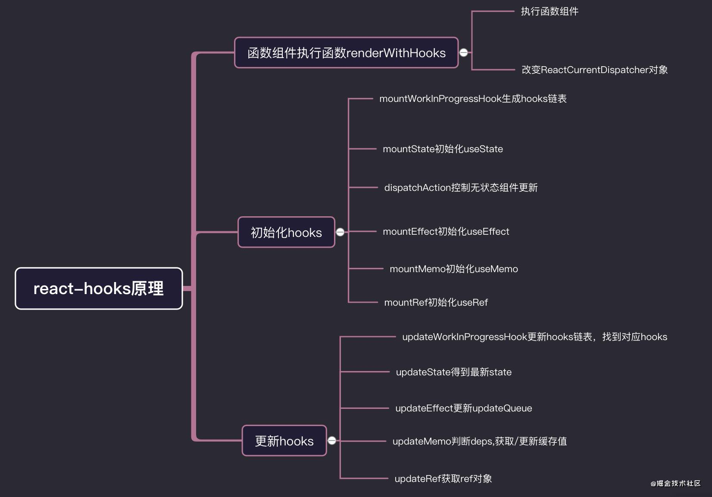
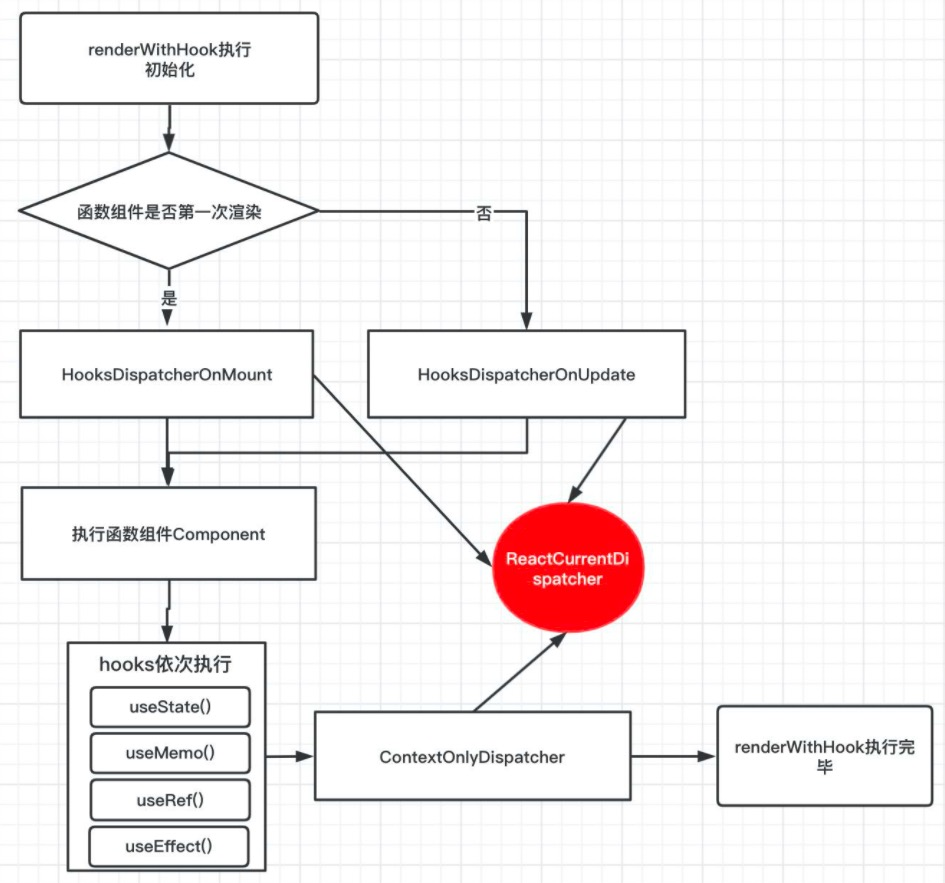
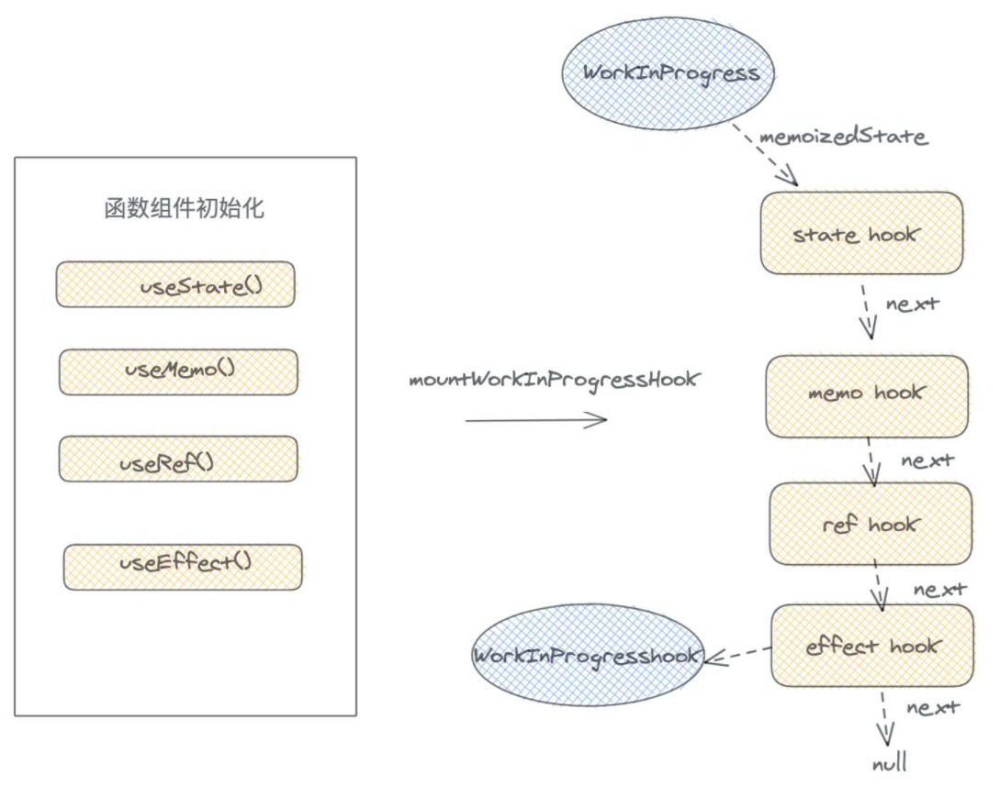

# Hooks
解决什么问题：hooks就是函数组件解决没有state，生命周期，逻辑不能复用的一种技术方案。

## hooks原理

### renderWithHooks函数
相关概念
```
currentfiber树: 当完成一次渲染之后，会产生一个current树,current会在commit阶段替换成真实的Dom树。
workInProgressfiber树: 即将调和渲染的 fiber 树。再一次新的组件更新过程中，会从current复制一份作为workInProgress,更新完毕后，将当前的workInProgress树赋值给current树。
workInProgress.memoizedState: 在class组件中，memoizedState存放state信息，在function组件中，memoizedState在一次调和渲染过程中，以链表的形式存放hooks信息。
workInProgress.expirationTime: react用不同的expirationTime,来确定更新的优先级。
currentHook: 可以理解 current树上的指向的当前调度的 hooks节点。
workInProgressHook: 可以理解 workInProgress树上指向的当前调度的 hooks节点。
```
具体作用：
```
1.置空workInProgress树的memoizedState和updateQueue，因为在接下来的函数组件的执行过程中，需要把新的hooks信息挂载上这两个属性，并在commit阶段将workInProgress树替换成current树，替换真实的DOM元素节点。并在current树保存hooks信息。
2.给ReactCurrentDispatcher.current赋值，根据是否首次渲染，也就是根据current上是否有memoizedState（hook信息）判断。
3.调用Component函数组件，依次执行hooks，并保存到workInProgress树上。
4.重新置空一些变量比如currentHook，currentlyRenderingFiber,workInProgressHook。
```


每次hooks执行，都会调用mountWorkInProgressHook，这个函数会产生一个hook对象，保存当前hook信息，再将每个hooks以链表的形式串联起来，赋值给workInProgress.memoizedState。

```
hook: {
    memoizedState： useState中 保存 state 信息 ｜ useEffect 中 保存着 effect 对象 ｜ useMemo 中 保存的是缓存的值和 deps ｜ useRef 中保存的是 ref 对象。
    baseQueue: usestate和useReducer中 保存最新的更新队列。
    baseState： usestate和useReducer中,一次更新中 ，产生的最新state值。
    queue： 保存待更新队列 pendingQueue ，更新函数 dispatch 等信息。
    next: 指向下一个 hooks对象。
}
```



**一旦在条件语句中声明hooks，在下一次函数组件更新，hooks链表结构，将会被破坏，current树的memoizedState缓存hooks信息，和当前workInProgress不一致，如果涉及到读取state等操作，就会发生异常。**

初始化阶段总结：初始化阶段,react-hooks做的事情，在一个函数组件第一次渲染执行上下文过程中，每个react-hooks执行，都会产生一个hook对象，并形成链表结构，绑定在workInProgress的memoizedState属性上，然后react-hooks上的状态，绑定在当前hooks对象的memoizedState属性上。对于effect副作用钩子，会绑定在workInProgress.updateQueue上，等到commit阶段，dom树构建完成，在执行每个 effect 副作用钩子。

更新阶段总结：每次函数组件更新，当再次执行hooks函数的时候，比如 useState(0) ，首先要从current的hooks中找到与当前workInProgressHook，对应的currentHooks，然后复制一份currentHooks给workInProgressHook,接下来hooks函数执行的时候,把最新的状态更新到workInProgressHook，保证hooks状态不丢失。由updateWorkInProgressHook函数完成。

## 关于hook性能优化常见方法

React.memo(`<Component />`)  原理和PureComponent一致

React.memo默认情况下其只会对 props 的复杂对象做**浅层对比**(浅层对比就是只会对比前后两次 **props** 对象引用是否相同，不会对比对象里面的内容是否相同)，如果你想要控制对比过程，那么请将**自定义的比较函数**通过第二个参数传入来实现。

如何保持局部不变 

**const data = useMemo(() => [], [])** 

**通过 useMemo 将引用存储起来，依赖不变引用也就不变。避免当父组件渲染的时候虽然有属性没有变，但是 该属性的引用已经变了。props传递给子组件的时候，如果即使使用了 React.memo但是性能优化也会失效。**

对于函数来说，想要保存它的引用可以使用 `useCallback` 。

**const onIncrement = useCallback(() => { setCount(count => count + 1) }, []) 避免频繁创建及销毁函数**

## 为什么要顺序调用hook

（官方有句话，必须顺序调用hook。衍生的其他规则：不要在if条件判断中使用hook、必须在函数组件内使用hook、不要在循环中使用hook（其实只要保证循环每次都完全一样还是可以的）

**React 会在第一次渲染时将每个 hook 按顺序放入 Hooks 数组中，下次渲染时，同样的hooks以相同的顺序被调用，所以React可以查看它的数组，并发现已经在位置0有一个useState hook ，所以React不会创建一个新状态，而是返回现有状态。**

这就是React能够在**多个函数调用中创建和维护状态的方式**，即使变量本身每次都超出作用域。

## 使用tips
1. hooks中useEffect方法第二个参数是用全等判断是否相等 如果是引用类型数据 则每次都会触发副作用 （可用JSON.stringify）
2. memo：第二个方法参数更精确控制重新渲染（不加的话只会浅比较）
3. useMemo：传递一个创建函数和一个依赖数组，然后返回一个记忆化的值。当依赖发生变化的时候（浅比较），useMemo 将重新计算记忆化值。这个优化可以帮助避免每次渲染的时候昂贵地计算。useMemo相当于在组件内部更细粒度控制更新逻辑 （如果没有提供依赖项数组，useMemo 在每次渲染时都会计算新的值 第二个参数为空数组，则只会在渲染组件时执行一次）