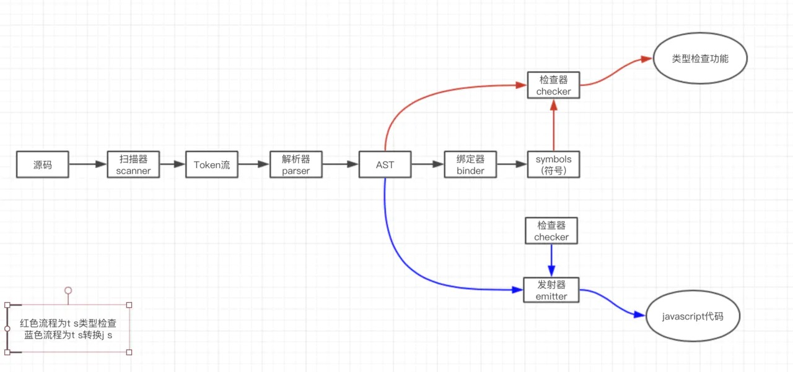

# 深入理解TS

## TS编译原理
TypeScript 编译器由几个关键部分组成：
Scanner 扫描器（scanner.ts）
Parser 解析器（parser.ts）
Binder 绑定器（binder.ts）
Checker 检查器（checker.ts）
Emitter 发射器（emitter.ts）

先借用网上一张图，看看各部分怎么组合起来的。

### 工作流
1. 解析器创建扫描器来将源码转化为抽象语法树(AST)。
首先对于SourceCode（源码） 通过 扫描器进行词法分析可以得到一组 Token 流，随后解析器进行语法分析得到 AST

2. 为了协助（检查器执行）类型检查，绑定器将源码的各部分连接成一个相关的类型系统，供检查器使用。绑定器的主要职责是解析作用域，创建符号表。
符号（Symbol）是 TypeScript 语义系统的主要构造块。符号是绑定的结果。符号将 AST 中的声明节点与相同实体的其他声明相连。

3. 检查器是 TS 不同于其他JavaScript转译器的重要部分，负责语义分析检查相关类型错误。

4. 转换器在编译成 JavaScript 之前会将语法进行转换成 ESNext 的语法，再替换掉旧版本不支持的语法，最后得到标准的 JavaScript 语法树。发射器负责生成代码，也就是将语法树重新拼装回代码，并保存到文件。

TypeScript 还会同时生成源映射（Source Map），以及类型描述文件（.d.ts）。
