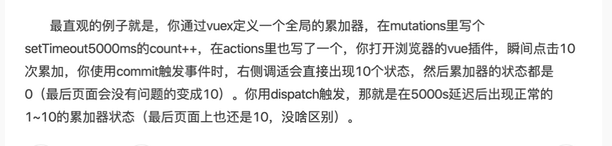
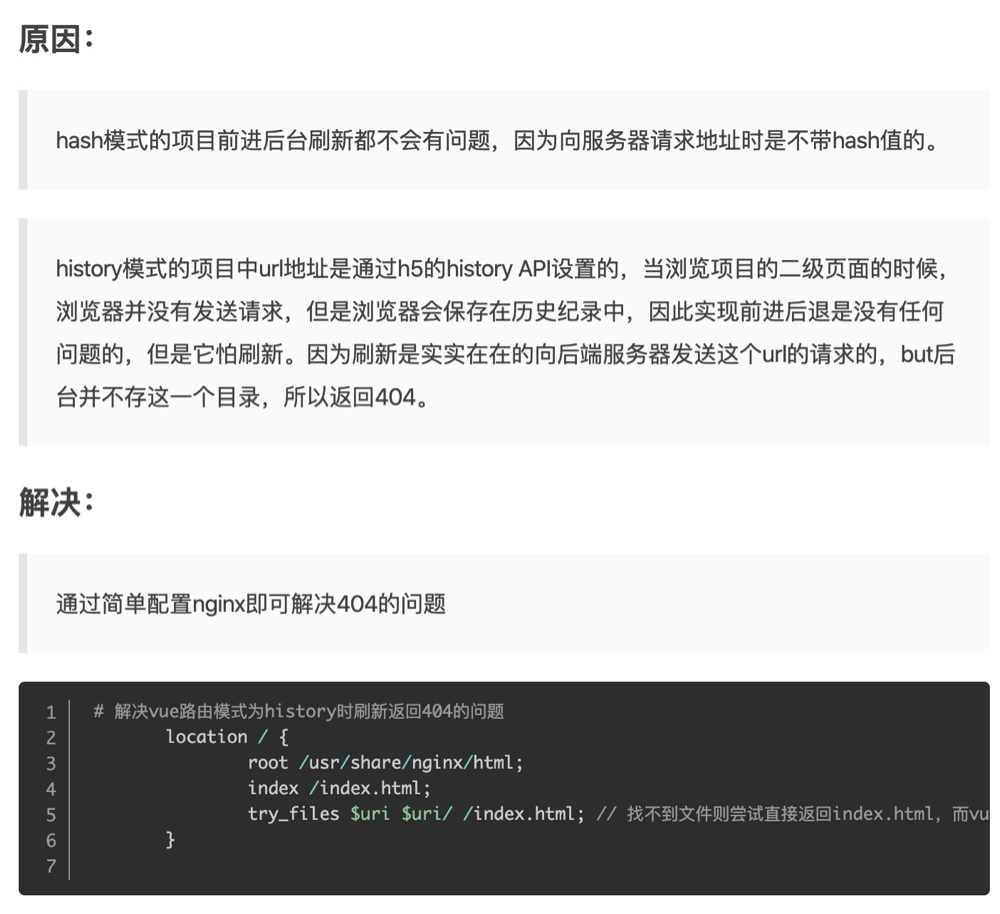

# Vuex和Vue-Router

## 关于vuex一些理解上的误区

**1.vuex怎么注入到全局共享并实时更新的？**

通过vue.mixin将vuexInit注入beforeCreate

**2.为什么mutation是同步的，action是异步的，且改变state只能通过mutation？**

非严格模式下可以直接手动直接修改state

区分 actions 和 mutations 并不是为了解决竞态问题，而是为了能用 devtools 追踪状态变化

actions 不是必须的，只是一个函数，想干啥都可以

**actions 可以在不同模块中可以触发多个 action 函数 （源码中的entry.length>0的情况）**

**mutation 必须是同步的 =>forEach执行每一个handler异步的话 顺序错乱 无法记录每一次变化（可能并不会出现bug）**

**3.刷新 => 清空**

javascript的代码都是运行在内存的，刷新页面，以前申请的内存会被释放，重新加载脚本代码，变量重新赋值。

## Store 实例化过程

1.初始化模块（modules）=>2.安装模块(对模块中的 state、getters、mutations、actions 做初始化工作)=>3.初始化store._vm（通过Vue使store做到响应式）

1.每个子模块通过路径找到它的父模块，然后通过父模块的 `addChild` 方法建立父子关系，递归执行这样的过程，建立一颗完整的模块树。

2.通过递归遍历的方式，完成所有子模块的安装工作 forEachMutation forEachAction forEachGetter forEachChild

3.resetStoreVM 想建立 `getters` 和 `state` 的联系 利用了 Vue 中用 `computed` 计算属性来实现

**Vuex的双向绑定通过调用 new Vue实现，然后通过 Vue.mixin 注入到Vue组件的生命周期中，再通过劫持state.get将数据放入组件中**

## vue-router的理解

Vue 从它的设计上就是一个渐进式 JavaScript 框架，它本身的核心是解决视图渲染的问题，其它的能力就通过插件的方式来解决。Vue-Router 就是官方维护的路由插件。

1.通过标志位为了确保 `install` 逻辑只执行一次。

2.利用 `Vue.mixin` 去把 `beforeCreate` 和 `destroyed` 钩子函数注入到每一个组件中。在 `beforeCreate` 做一些私有属性定义和路由初始化工作。

3.VueRouter 的实现是一个类，初始化时通过mode新建了不同的history类，init时调用了history.transitionTo做路由过渡。

**hash模式**

hash模式的工作原理是**hashchange事件，可以在window监听hash的变化**。我们在url后面随便添加一个#xx触发这个事件，**页面不会发生跳转**。

**history模式**

这种模式充分利用 `history.pushState` API 来**完成 URL 跳转而无须重新加载页面**。

**history.pushState()主要是在不刷新浏览器的情况下，创建新的浏览记录并插入浏览记录队列中。**

原先api：go back forward

HTML5新增的historyAPI有3样武器，**history.pushState(stateObject, title, url)、history.replaceState()、window.onpopstate** 分别能够在浏览器history对象中偷偷的生成一条新的历史记录(不发送请求)，替换一条历史记录(不发送请求)，当前进后退history到前两者的留下的历史记录时做出反应。

因为我们的应用是个单页客户端应用，如果后台没有正确的配置，当用户在浏览器直接访问http://www.yongcun.wang/tclass就会返回 404，这就不好看了。

所以呢，**你要在服务端增加一个覆盖所有情况的候选资源：如果 URL 匹配不到任何静态资源，则应该返回同一个 index.html 页面，这个页面就是你 app 依赖的页面。**

nginx--高性能的HTTP和反向代理web服务器

try_files 按顺序检查文件是否存在，返回第一个找到的文件。结尾的斜线表示为文件夹 -$uri/。如果所有的文件都找不到，会进行一个内部重定向到最后一个参数。