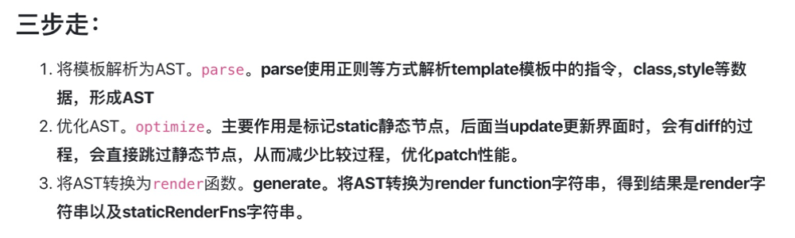
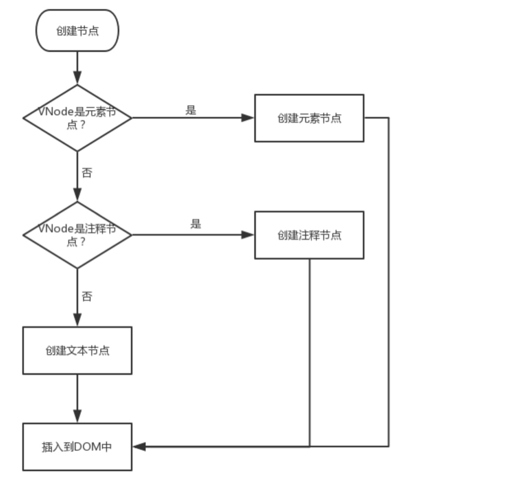
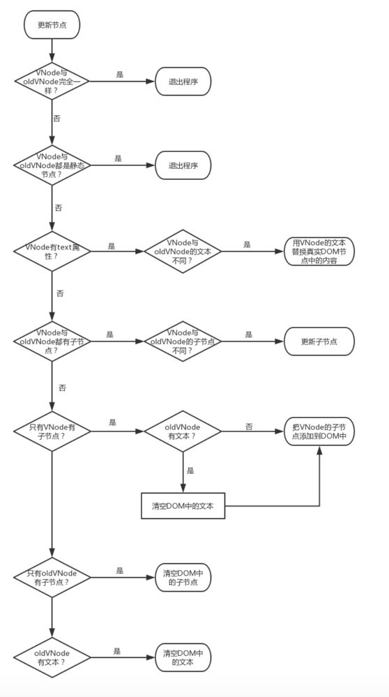
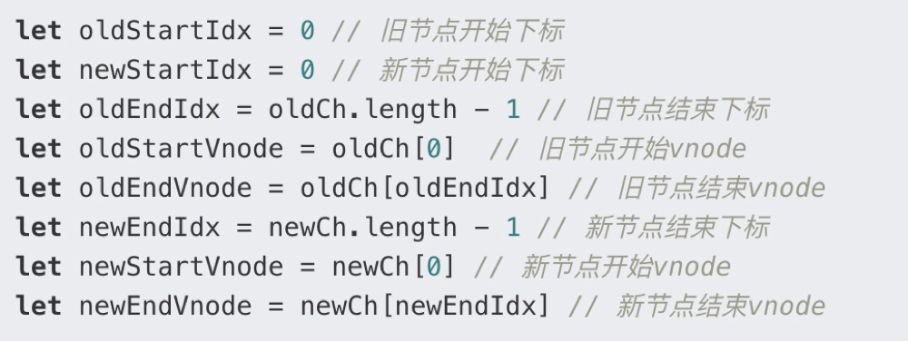

# Vue实现原理

## Vue 编译过程

一个是 Runtime + Compiler 的，一个是 Runtime only 的，前者是包含编译代码的，可以把编译过程放在运行时做，后者是不包含编译代码的，需要借助 webpack 的 `vue-loader` 事先把模板编译成 `render`函数。



**解析模板字符串生成 AST**

```js
const ast = parse(template.trim(), options)
```

**优化语法树**

```js
optimize(ast, options)
```

**生成代码**

```js
const code = generate(ast, options)
```

**parse**

编译过程首先就是对模板做解析，生成 AST，它是一种抽象语法树，是对源代码的抽象语法结构的树状表现形式。在很多编译技术中，如 babel 编译 ES6 的代码都会先生成 AST。

**`parse` 的目标是把 `template` 模板字符串转换成 AST 树，它是一种用 JavaScript 对象的形式来描述整个模板。那么整个 `parse` 的过程是利用正则表达式顺序解析模板，当解析到开始标签、闭合标签、文本的时候都会分别执行对应的回调函数，来达到构造 AST 树的目的。**

**optimize**

（我们的模板并不是所有数据都是响应式的，也有很多数据是首次渲染后就永远不会变化的，那么这部分数据生成的 DOM 也不会变化，我们可以在 `patch` 的过程跳过对他们的比对。）

1. 在`AST`中找出所有静态节点并打上标记；
2. 在`AST`中找出所有静态根节点并打上标记；

**就是深度遍历这个 AST 树，去检测它的每一颗子树是不是静态节点，如果是静态节点则它们生成 DOM 永远不需要改变，这对运行时对模板的更新起到极大的优化作用。**

我们通过 `optimize` 我们把整个 AST 树中的每一个 AST 元素节点标记了 `static` 和 `staticRoot`，它会影响我们接下来执行代码生成的过程。

**codegen**

**代码生成其实就是根据模板对应的抽象语法树`AST`生成一个render函数供组件挂载时调用，通过调用这个函数就可以得到模板对应的虚拟`DOM`。**

通过这些_c,_v等函数，render函数最后会返回一个VNode节点，在_update的时候，经过patch与之前的VNode节点进行比较，得出差异后将这些差异渲染到真实的DOM上。

#### vue中的模板解析和渲染的核心就是：**通过类似snabbdom的h()和patch()的函数，先将模板解析成vnode，如果是初次渲染，则通过patch(container,vnode)将vnode渲染至页面，如果是二次渲染，则通过patch(vnode,newVnode)，先通过Diff算法比较原vnode和newVnode的差异，以最小的代价重新渲染页面。**

## Vue DOM-Diff(patch) 过程

 VNode 是对真实 DOM 的一种抽象描述，它的核心定义无非就几个关键属性，标签名、数据、子节点、键值等，其它属性都是用来扩展 VNode 的灵活性以及实现一些特殊 feature 的。**由于 VNode 只是用来映射到真实 DOM 的渲染，不需要包含操作 DOM 的方法，因此它是非常轻量和简单的。**

**使用虚拟 `DOM` 也能使得 `Vue` 不再依赖于浏览器环境。我们可以很容易的在 `Broswer` 端或者服务器端操作虚拟 `DOM`, 需要 `render` 时再将虚拟 `DOM` 转换为真实 `DOM` 即可。这也使得 `Vue` 有了实现服务器端渲染的能力。**

**所有 Vue 的组件的渲染最终都需要 `render` 方法，将el或template转换成render（）是调用 `compileToFunctions` 方法，之后在mounted钩子中调用_render，`_render` 方法是实例的一个私有方法，它用来把实例渲染成一个虚拟 Node，render会调用后面的createElement。**

Virtual DOM 除了它的数据结构的定义，映射到真实的 DOM 实际上要经历 VNode 的 create、diff、patch 等过程。

create：每个 VNode 有 `children`，`children` 每个元素也是一个 VNode，这样就形成了一个 VNode Tree

update：VNode 渲染成一个真实的 DOM  一次是首次渲染，一个是数据更新的时候  主要靠patch实现

`patch` 是平台相关的，在 Web 和 Weex 环境，它们把虚拟 DOM 映射到 “平台 DOM” 的方法是不同的

最终是调用原生 DOM 的 API 进行 DOM 操作。

patch只做三件事：

- **创建节点：新的`VNode`中有而旧的`oldVNode`中没有，就在旧的`oldVNode`中创建。**

- **删除节点：新的`VNode`中没有而旧的`oldVNode`中有，就从旧的`oldVNode`中删除。**

- **更新节点：新的`VNode`和旧的`oldVNode`中都有，就以新的`VNode`为准，更新旧的`oldVNode`。**

如果新旧`VNode`里都包含了子节点，那么对于子节点的更新在代码里调用了`updateChildren`方法(diff核心)





**优先处理特殊场景**：更新子节点的优化：`Vue`为了避免双重循环数据量大时间复杂度升高带来的性能问题，而选择了从子节点数组中的4个特殊位置互相比对，分别是：新前与旧前，新后与旧后，新后与旧前，新前与旧后。

**原地复用**：**如果是同类节点，Vue会尽可能复用DOM，尽可能不发生DOM的移动。**

函数柯里化=>通过createPatchFunction把差异化参数提前固化（不同平台调用不同createPatchFunction）

## diff算法原理（三步）

通过**同层的树节点进行比较而非对树进行逐层搜索遍历**的方式，所以时间复杂度是O(n)，是非常高效的算法。

一、vue 的虚拟 dom 渲染真实 dom 的过程中首先会对**新老 VNode 的开始和结束位置进行标记**：



二、标记好节点位置之后，就开始进入到的 while 循环处理中，这里是 diff 算法的核心流程，分情况进行了**新老节点的比较并移动对应的 VNode 节点**。while 循环的**退出条件是直到老节点或者新节点的开始位置大于结束位置**。（**sameVnode：key、tag等属性；patchVnode为更新旧节点：检查是否含静态节点、文本、子节点等**）

情形一：当新老 VNode 节点的 start 满足sameVnode 时，直接 patchVnode 即可，同时新老 VNode 节点的开始索引都加1。

情形二：当新老 VNode 节点的 end 满足 sameVnode 时，同样直接 patchVnode 即可，同时新老 VNode 节点的结束索引都减1。

情形三：当老 VNode 节点的 start 和新 VNode 节点的 end 满足 sameVnode 时，这说明这次数据更新后 oldStartVnode 已经跑到了 oldEndVnode 后面去了。这时候在 patchVnode 后，还需要将当前真实 dom 节点移动到 oldEndVnode 的后面，同时老 VNode 节点开始索引加1，新 VNode 节点的结束索引减1。

情形四：当老 VNode 节点的 end 和新 VNode 节点的 start 满足 sameVnode 时，这说明这次数据更新后 oldEndVnode 跑到了 oldStartVnode 的前面去了。这时候在 patchVnode 后，还需要将当前真实 dom 节点移动到 oldStartVnode 的前面，同时老 VNode 节点结束索引减1，新 VNode 节点的开始索引加1。

**如果都不满足以上四种情形，那说明没有相同的节点可以复用，**，于是则通过查找事先建立好的以旧的 VNode 为 key 值，对应 index 序列为 value 值的**哈希表**。从这个哈希表中找到与 newStartVnode 一致 key 的旧的 VNode 节点，如果两者满足 sameVnode 的条件，在进行 patchVnode 的同时会将这个真实 dom 移动到 oldStartVnode 对应的真实 dom 的前面；如果没有找到，则说明当前索引下的新的 VNode 节点在旧的 VNode 队列中不存在，无法进行节点的复用，那么就只能调用 createElm 创建一个新的 dom 节点放到当前 newStartIdx 的位置。

三、当 while 循环结束后，**根据新老节点的数目不同，做相应的节点添加或者删除**。若新节点数目大于老节点则需要把多出来的节点创建出来加入到真实 dom 中，反之若老节点数目大于新节点则需要把多出来的老节点从真实 dom 中删除。至此整个 diff 过程就已经全部完成了。

### **vue3 diff算法** 双端对比的基础上改进

**预处理：先从前往后比较，当节点不同时，不再往后进行比较。接着又从后往前进行比较，当节点不同时，不再往前进行比较。**

处理相同的前后节点并判断是否仅有节点的新增或删除。

**预处理过后，剩下的节点会借助最长递增子序列来提高 diff 效率。求解最长递增子序列，主要的目的就是为了减少 dom 元素的移动，也可以理解为最少的 dom 操作。**

在求解得到最长递增子序列之后，剩下的就是遍历新节点中的待处理节点，判断是否节点是否属于新增，是否需要进行移动。