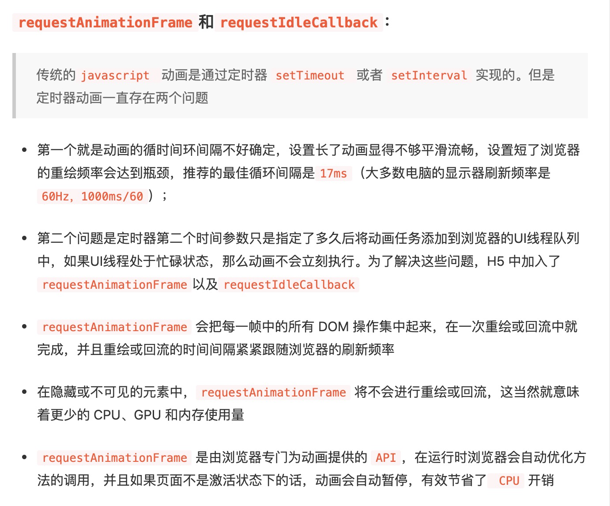
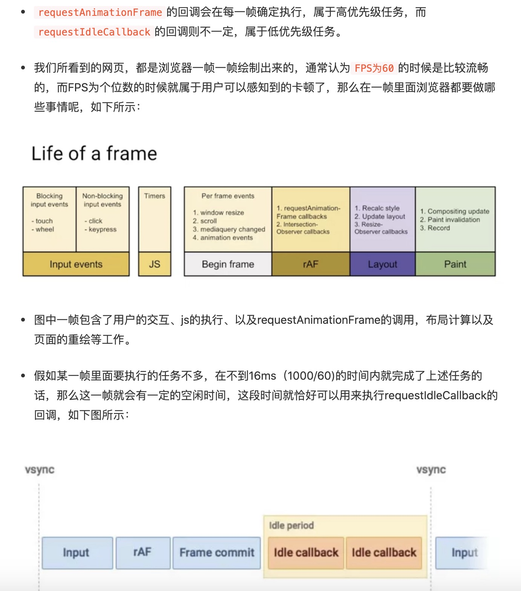

# 性能优化
小程序项目：性能监控，利用开发者工具自带的Audits 面板或者浏览器的Performance API，关注一些耗时情况。

**dom解析时间长=>虚拟列表**

**onload时间长=>资源预加载**

## 小程序的预加载

```
在页面跳转前实现接口的调用并注入globalData，在下个页面直接使用对应的globalData，为了用户体验的提升，可以适当延迟跳转。
拆分为dns-prefetch, subresource, prefetch, preconnect和 prerender
针对图片音视频(一般js、css压缩后只有一个文件，甚至有些团队直接把压缩后的代码放在行内)
preload 是告诉浏览器页面必定需要的资源，浏览器一定会加载这些资源；
prefetch 是告诉浏览器页面可能需要的资源，浏览器不一定会加载这些资源。
preload 加载页面必需的资源如 CDN 上的字体文件，与 prefetch 预测加载下一屏数据，兴许是个不错的组合。
```

页面是一帧一帧绘制出来的，当每秒绘制的帧数（FPS）达到 60 时，页面是流畅的，小于这个值时，用户会感觉到卡顿。1s 60帧，所以每一帧分到的时间是 1000/60 ≈ 16 ms。所以我们书写代码时力求不让一帧的工作量超过 16ms。每帧要做的事：
1. 处理用户的交互  
2. JS 解析执行  
3. 帧开始。窗口尺寸变更，页面滚去等的处理
4. requestAnimationFrame(rAF) 
5. 布局  
6. 绘制

上述6个步骤完成没超过 16 ms的话 => requestIdleCallback

假如浏览器一直处于非常忙碌的状态，requestIdleCallback 注册的任务有可能永远不会执行。此时可通过设置 timeout 来保证执行。

总结：requestIdleCallback 所执行的任务应该尽量是低优先级能够量化，细分的微任务

因为它发生在一帧的最后，此时页面布局已经完成，所以不建议在 requestIdleCallback 里再操作 DOM，这样会导致页面再次重绘。DOM 操作建议在 rAF 中进行。

## 耗时计算
```
重定向耗时 = redirectEnd - redirectStart;
DNS查询耗时 = domainLookupEnd - domainLookupStart;
TCP链接耗时 = connectEnd - connectStart;
HTTP请求耗时 = responseEnd - responseStart;
1.白屏时间 = responseStart - navigationStart;100ms以内
（浏览器开始显示内容的时间）
2.解析dom树耗时 = domComplete - domInteractive;0.8s=>0.4s虚拟列表
（从dom元素可以被访问，到页面dom内容完全解析）
3.DOMready时间 = domContentLoadedEventEnd - navigationStart;0.7s=>0.5s
（此事件在浏览器生成dom树文档结构准备完毕后触发, 即在资源加载前触发）
4.onload时间 = loadEventEnd - navigationStart;1.5s左右=>0.75s
（页面所有的资源都加载完毕）
```
## 关于RAF和RIC

