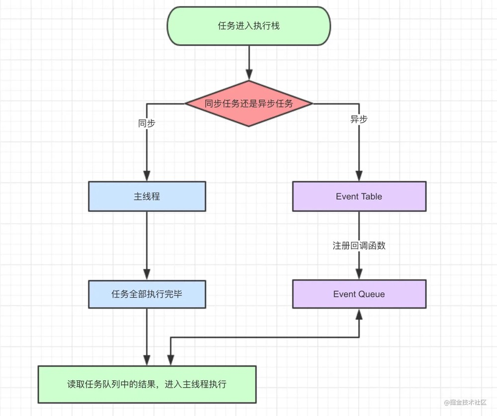
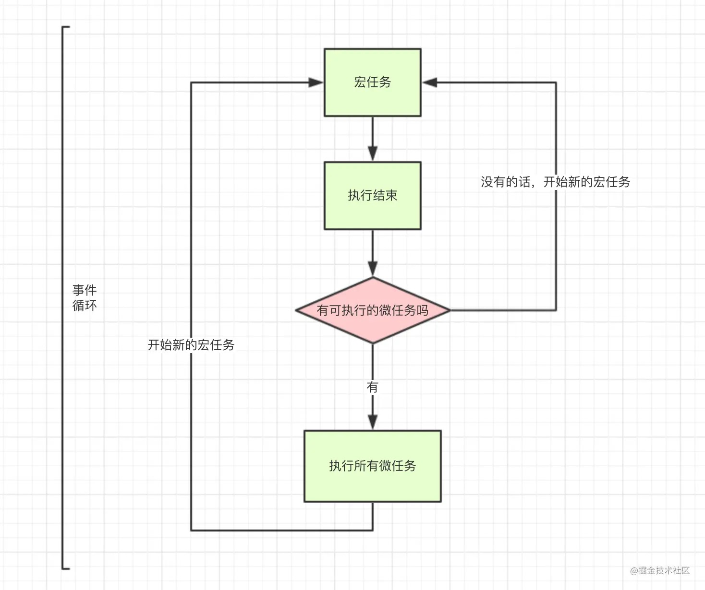

# JS执行机制

**JavaScript是一门单线程语言**

**Event Loop是javascript的执行机制**

## JS事件循环

导图要表达的内容用文字来表述的话：

1. **同步和异步任务分别进入不同的执行"场所"，同步的进入主线程，异步的进入Event Table并注册函数。**
2. **当指定的事情完成时，Event Table会将这个函数移入Event Queue。**
3. **主线程内的任务执行完毕为空，会去Event Queue读取对应的函数，进入主线程执行。**
4. **上述过程会不断重复，也就是常说的Event Loop(事件循环)。**

**js引擎存在monitoring process进程，会持续不断的检查主线程执行栈是否为空，一旦为空，就会去Event Queue那里检查是否有等待被调用的函数。**

## 宏任务与微任务
macro-task(宏任务)：包括整体代码script，setTimeout，setInterval，requestAnimationFrame，MessageChannel，postMessage，UI rendering/UI事件，setImmediate(Node.js)

micro-task(微任务)：Promise.then，MutationObserver，process.nextTick(Node.js)

