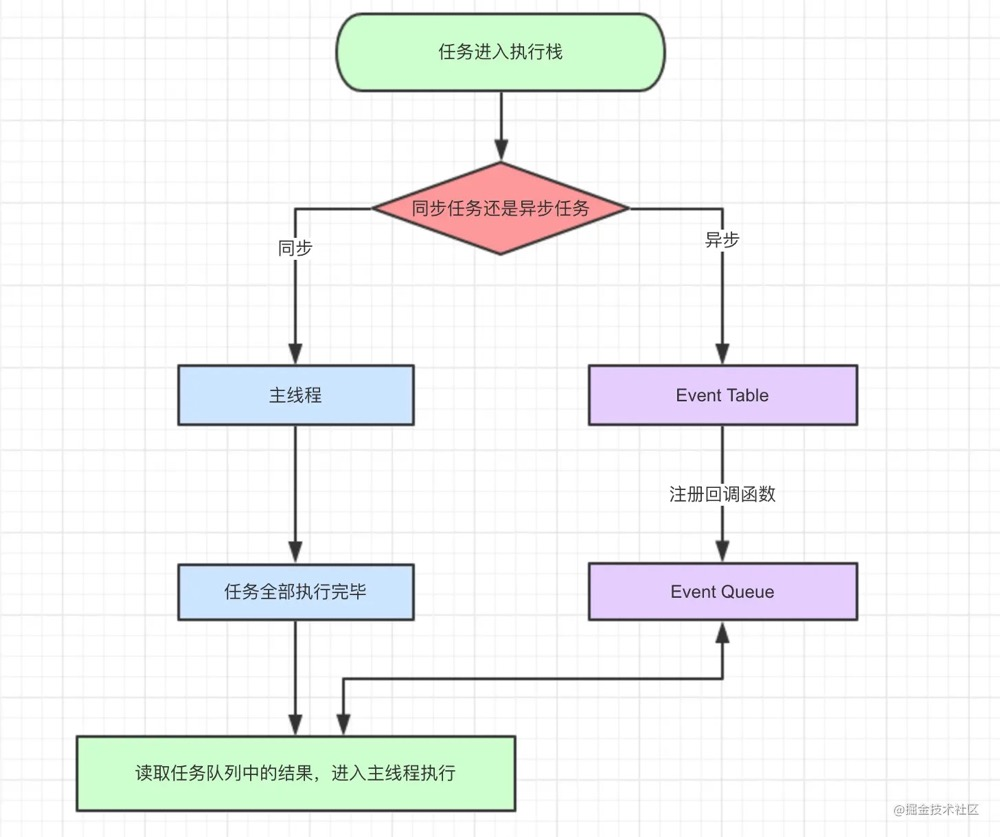
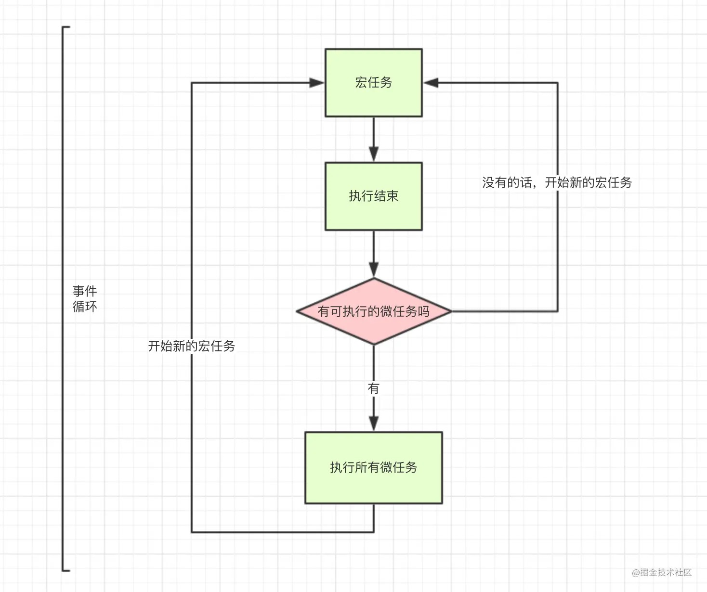
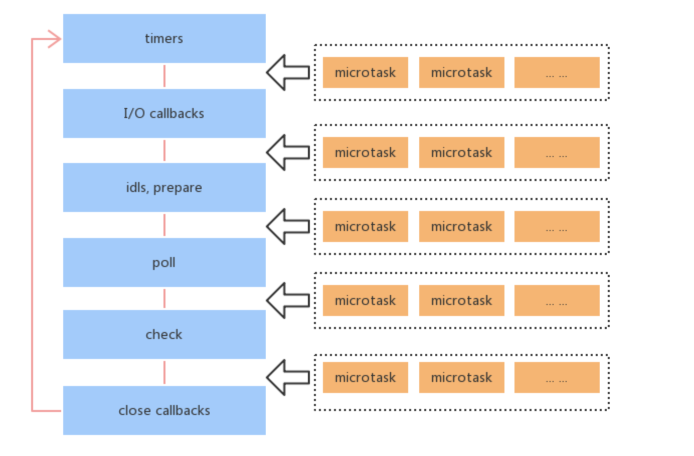

# JS执行机制

**JavaScript是一门单线程语言**

**Event Loop是javascript的执行机制**

## JS事件循环

导图要表达的内容用文字来表述的话：

1. **同步和异步任务分别进入不同的执行"场所"，同步的进入主线程，异步的进入Event Table并注册函数。**
2. **当指定的事情完成时，Event Table会将这个函数移入Event Queue。**
3. **主线程内的任务执行完毕为空，会去Event Queue读取对应的函数，进入主线程执行。**
4. **上述过程会不断重复，也就是常说的Event Loop(事件循环)。**

**js引擎存在monitoring process进程，会持续不断的检查主线程执行栈是否为空，一旦为空，就会去Event Queue那里检查是否有等待被调用的函数。**

## 宏任务与微任务
macro-task(宏任务)：包括整体代码script，setTimeout，setInterval，requestAnimationFrame，MessageChannel，postMessage，UI rendering/UI事件，setImmediate(Node.js)

micro-task(微任务)：Promise.then，MutationObserver，process.nextTick(Node.js)

## NodeJs中的事件循环
Node.js采用V8作为js的解析引擎，而I/O处理方面使用了自己设计的libuv，libuv是一个基于事件驱动的跨平台抽象层，封装了不同操作系统一些底层特性，对外提供统一的API，事件循环机制也是它里面的实现。

（nodejs的的事件循环由libuv的uv_run函数实现。在该函数中执行while循环，然后处理各种阶段（phase）的事件回调。事件循环的处理相当于一个消费者，消费由各业务代码生产的任务。）

1. **timers阶段**：这个阶段执行timer（setTimeout、setInterval）的回调
2. I/O callbacks：执行延迟到下一个循环迭代的 I/O 回调
3. idle,prepare：仅node内部使用（自定义的一些任务）
4. **poll**（轮询）：处理网络io、文件io的地方，获取新的I/O事件, 适当的条件下node将阻塞在这里
5. **check**：执行 setImmediate() 的回调
6. close callbacks：执行 socket 的 close 事件回调

### timers 阶段
timers 是事件循环的第一个阶段，Node 会去检查有无已过期的timer，如果有则把它的回调压入timer的任务队列中等待执行，事实上，Node 并不能保证timer在预设时间到了就会立即执行，因为Node对timer的过期检查不一定靠谱，它会受机器上其它运行程序影响，或者那个时间点主线程不空闲。

### poll 阶段
poll 阶段主要有2个功能：
1. 处理 poll 队列的事件
2. 当有已超时的 timer，执行它的回调函数

event loop将同步执行poll队列里的回调，直到队列为空或执行的回调达到系统上限（上限具体多少未详），接下来event loop会去检查有无预设的setImmediate()，分两种情况：

1. 若有预设的setImmediate(), event loop将结束poll阶段进入check阶段，并执行check阶段的任务队列
2. 若没有预设的setImmediate()，event loop将阻塞在该阶段等待

### check 阶段
setImmediate()的回调会被加入check队列中， 从event loop的阶段图可以知道，check阶段的执行顺序在poll阶段之后。

### 小结
1. event loop 的每个阶段都有一个任务队列
2. 当 event loop 到达某个阶段时，将执行该阶段的任务队列，直到队列清空或执行的回调达到系统上限后，才会转入下一个阶段
3. 当所有阶段被顺序执行一次后，称 event loop 完成了一个 tick

### Node.js 与浏览器的 Event Loop 差异
1. Node.js 的事件循环分为6个阶段
2. 浏览器和Node 环境下，microtask 任务队列的执行时机不同：
Node.js中，microtask 在事件循环的各个阶段之间执行；
浏览器端，microtask 在事件循环的 macrotask 执行完之后执行
3. 递归的调用process.nextTick()会导致I/O starving，官方推荐使用setImmediate()