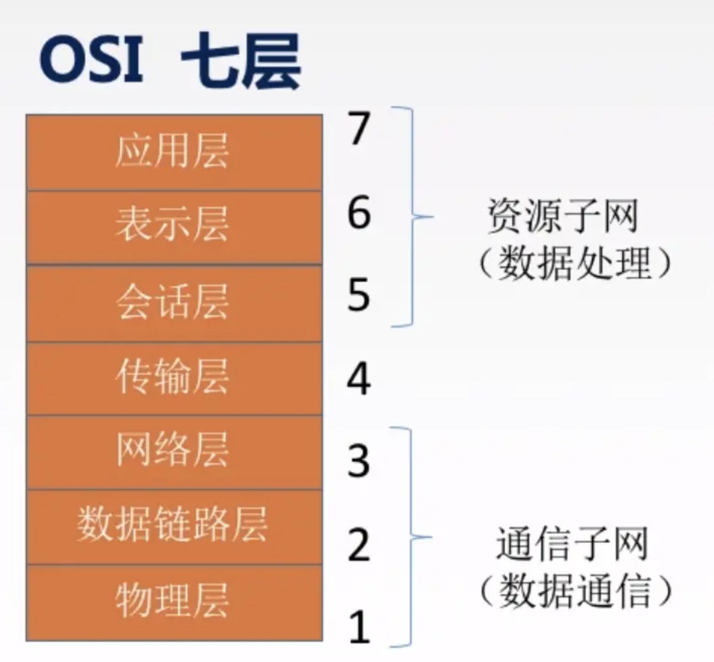

# 概览

计算机网络是指将地理位置不同的具有独立功能的多台计算机及其外部设备，通过通信线路连接起来，在网络操作系统，网络管理软件及网络通信协议的管理和协调下，实现资源共享和信息传递的计算机系统。

## 计算机网络的组成

1. 计算机系统

建立两台以上具有独立功能的计算机系统是计算机网络的第一个要素，计算机系统是计算机网络的重要组成部分，是计算机网络不可缺少的硬件元素。

2. 通信设备和通信线路

计算机网络的硬件部分除了计算机本身以外，还要有用于连接这些计算机的通信线路和通信设备，即数据通信系统。通信线路分有线通信线路和无线通信线路。通信设备指网络连接设备、网络互联设备，包括网卡、集线器（Hub）、中继器（Repeater）、交换机（Switch）、网桥（Bridge）和路由器（Router）以及调制解调器（Modem）等其他的通信设备。

3. 网络协议

协议是指通信双方必须共同遵守的约定和通信规则，如TCP/IP协议、NetBEUI协议、IPX/SPX协议。它是通信双方关于通信如何进行所达成的协议。一般说来，协议的实现是由软件和硬件分别或配合完成的，有的部分由联网设备来承担。

4. 网络软件

网络软件是一种在网络环境下使用和运行或者控制和管理网络工作的计算机软件。根据软件的功能，计算机网络软件可分为网络系统软件和网络应用软件两大类型。

网络系统软件是控制和管理网络运行、提供网络通信、分配和管理共享资源的网络软件，它包括网络操作系统、网络协议软件、通信控制软件和管理软件等。

网络应用软件是指为某一个应用目的而开发的网络软件（如远程教学软件、电子图书馆软件、Internet信息服务软件等）。网络应用软件为用户提供访问网络的手段、网络服务、资源共享和信息的传输。

## 衡量计算机网络的性能的指标
1. 速率

速率就是数据传输（数据是指0和1）的速率，比如你用迅雷下载，1兆每秒，来衡量目前数据传输的快慢。它是计算机网络中最重要的一个性能指标。

2. 带宽

在计算机网络中，网络带宽是指在单位时间（一般指的是1秒钟）内能传输的数据量，比如说你家的电信网络是100兆比特，意思是，一秒内最大的传输速率是100兆比特。

3. 吞吐量

吞吐量表示在单位时间内通过某个网络（或信道、接口）的数据量。

4. 时延

时延是指数据（报文/分组/比特流）从网络（或链路）的一端传送到另一端所需的时间。单位是s。

## OSI参考模型
1，2，3层主要是是物理链路组成的，比如光纤，路由器，集线器，主要负责的是数据通信。5，6，7层是软件控制的，比如http协议，是一种软件层面控制的协议，主要负责处理传输来的数据。

